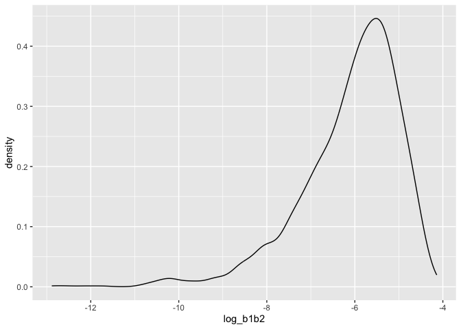
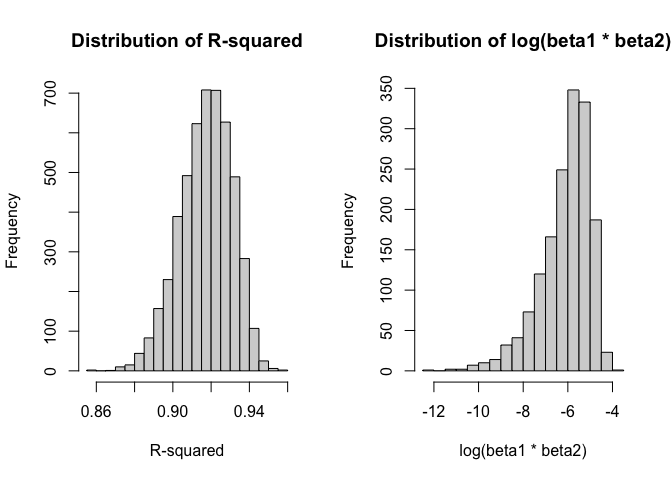
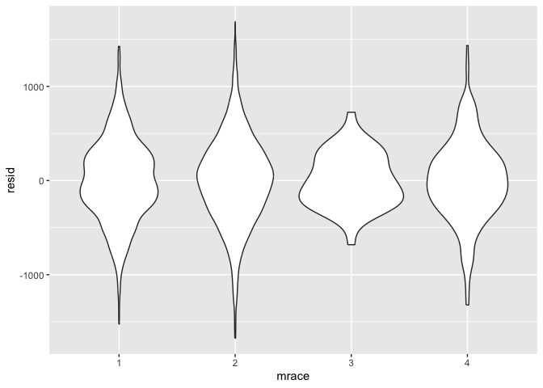
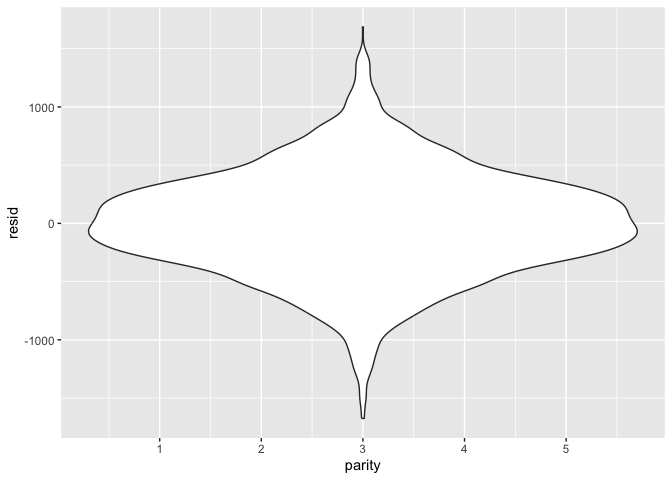

Homework Assignemnt 6 <br> (P8105_HW6_jao2195)
================
Jennifer Osei <br>
Saturday December 02, 2023

################################################################################ 

### Problem 0

################################################################################ 

Problem 0 This “problem” focuses on structure of your submission,
especially the use git and GitHub for reproducibility, R Projects to
organize your work, R Markdown to write reproducible reports, relative
paths to load data from local files, and reasonable naming structures
for your files.

To that end: -Create a public GitHub repo + local R Project; we suggest
naming this repo / directory p8105_hw6_YOURUNI (e.g. p8105_hw6_ajg2202
for Jeff), but that’s not required

-Create a single .Rmd file named p8105_hw6_YOURUNI.Rmd that renders to
github_document create a subdirectory to store the local data files used
in the assignment, and use relative paths to access these data files
submit a link to your repo via Courseworks

Your solutions to Problems 1 and 2 should be implemented in your .Rmd
file, and your git commit history should reflect the process you used to
solve these Problems.

For this Problem, we will assess adherence to the instructions above
regarding repo structure, git commit history, and whether we are able to
knit your .Rmd to ensure that your work is reproducible. Adherence to
appropriate styling and clarity of code will be assessed in Problems 1+
using the style rubric.

This homework includes figures; the readability of your embedded plots
(e.g. font sizes, axis labels, titles) will be assessed in Problems 1+.

``` r
#Needed libaries

# install.packages("tidyverse")
# install.packages("modelr")
# install.packages("boot")

library(tidyverse)
library(modelr)
library(boot)
```

################################################################################ 

### Problem 1

################################################################################ 

Background: The Washington Post has gathered data on homicides in 50
large U.S. cities and made the data available through a GitHub
repository here. You can read their accompanying article here.

**1A** **1aQ** Create a city_state variable (e.g. “Baltimore, MD”), and
a binary variable indicating whether the homicide is solved. Omit cities
Dallas, TX; Phoenix, AZ; and Kansas City, MO – these don’t report victim
race. Also omit Tulsa, AL – this is a data entry mistake. For this
problem, limit your analysis those for whom victim_race is white or
black. Be sure that victim_age is numeric.

**1aC**

``` r
homicide_df =
  read_csv("data/homicide-data.csv", na = c("", "NA", "Unknown")) |>
  mutate(
    city_state = str_c(city, state, sep = ", "),
    victim_age = as.numeric(victim_age),
    resolution = case_when(
      disposition == "Closed without arrest" ~ 0,
      disposition == "Open/No arrest"        ~ 0,
      disposition == "Closed by arrest"      ~ 1)
  ) |>
  filter(victim_race %in% c("White", "Black")) |>
  filter(!(city_state %in% c("Tulsa, AL", "Dallas, TX", "Phoenix, AZ", "Kansas City, MO"))) |>
  select(city_state, resolution, victim_age, victim_sex, victim_race)
```

    ## Rows: 52179 Columns: 12
    ## ── Column specification ────────────────────────────────────────────────────────
    ## Delimiter: ","
    ## chr (8): uid, victim_last, victim_first, victim_race, victim_sex, city, stat...
    ## dbl (4): reported_date, victim_age, lat, lon
    ## 
    ## ℹ Use `spec()` to retrieve the full column specification for this data.
    ## ℹ Specify the column types or set `show_col_types = FALSE` to quiet this message.

**1aA** In the data cleaning code below we create a `city_state`
variable, change `victim_age` to numeric, modifiy victim_race to have
categories white and non-white, with white as the reference category,
and create a `resolution` variable indicating whether the homicide is
solved. Lastly, we filtered out the following cities: Tulsa, AL; Dallas,
TX; Phoenix, AZ; and Kansas City, MO; and we retained only the variables
`city_state`, `resolution`, `victim_age`, `victim_sex`, and
`victim_race`.

**1B** **1bQ** For the city of Baltimore, MD, use the glm function to
fit a logistic regression with resolved vs unresolved as the outcome and
victim age, sex and race as predictors. Save the output of glm as an R
object; apply the broom::tidy to this object; and obtain the estimate
and confidence interval of the adjusted odds ratio for solving homicides
comparing male victims to female victims keeping all other variables
fixed.

**1bA.** Next we fit a logistic regression model using only data from
Baltimore, MD. We model `resolved` as the outcome and `victim_age`,
`victim_sex`, and `victim_race` as predictors. We save the output as
`baltimore_glm` so that we can apply `broom::tidy` to this object and
obtain the estimate and confidence interval of the adjusted odds ratio
for solving homicides comparing non-white victims to white victims.

**1bC**

``` r
baltimore_glm =
  filter(homicide_df, city_state == "Baltimore, MD") |>
  glm(resolution ~ victim_age + victim_sex + victim_race, family = binomial(), data = _)

baltimore_glm |>
  broom::tidy() |>
  mutate(
    OR = exp(estimate),
    OR_CI_upper = exp(estimate + 1.96 * std.error),
    OR_CI_lower = exp(estimate - 1.96 * std.error)) |>
  filter(term == "victim_sexMale") |>
  select(OR, OR_CI_lower, OR_CI_upper) |>
  knitr::kable(digits = 3)
```

|    OR | OR_CI_lower | OR_CI_upper |
|------:|------------:|------------:|
| 0.426 |       0.325 |       0.558 |

**1C** **1cQ** Now run glm for each of the cities in your dataset, and
extract the adjusted odds ratio (and CI) for solving homicides comparing
male victims to female victims. Do this within a “tidy” pipeline, making
use of purrr::map, list columns, and unnest as necessary to create a
dataframe with estimated ORs and CIs for each city.

**1cA** Below, by incorporating `nest()`, `map()`, and `unnest()` into
the preceding Baltimore-specific code, we fit a model for each of the
cities, and extract the adjusted odds ratio (and CI) for solving
homicides comparing non-white victims to white victims. We show the
first 5 rows of the resulting dataframe of model results.

**1cC**

``` r
model_results =
  homicide_df %>%
  nest(data = -city_state) %>%
  mutate(
    models = map(data, \(df) glm(resolution ~ victim_age + victim_sex + victim_race,
                             family = binomial(), data = df)),
    tidy_models = map(models, broom::tidy)) %>%
  select(-models, -data) %>%
  unnest(cols = tidy_models) %>%
  mutate(
    OR = exp(estimate),
    OR_CI_upper = exp(estimate + 1.96 * std.error),
    OR_CI_lower = exp(estimate - 1.96 * std.error)) %>%
  filter(term == "victim_sexMale") |>
  select(city_state, OR, OR_CI_lower, OR_CI_upper)

model_results |>
  slice(1:5) |>
  knitr::kable(digits = 3)
```

| city_state      |    OR | OR_CI_lower | OR_CI_upper |
|:----------------|------:|------------:|------------:|
| Albuquerque, NM | 1.767 |       0.831 |       3.761 |
| Atlanta, GA     | 1.000 |       0.684 |       1.463 |
| Baltimore, MD   | 0.426 |       0.325 |       0.558 |
| Baton Rouge, LA | 0.381 |       0.209 |       0.695 |
| Birmingham, AL  | 0.870 |       0.574 |       1.318 |

**1D** **1dQ** Create a plot that shows the estimated ORs and CIs for
each city. Organize cities according to estimated OR, and comment on the
plot.

**1dA** Below we generate a plot of the estimated ORs and CIs for each
city, ordered by magnitude of the OR from smallest to largest. From this
plot we see that most cities have odds ratios that are smaller than 1,
suggesting that crimes with male victims have smaller odds of resolution
compared to crimes with female victims after adjusting for victim age
and race. This disparity is strongest in New yrok. In roughly half of
these cities, confidence intervals are narrow and do not contain 1,
suggesting a significant difference in resolution rates by sex after
adjustment for victim age and race.

**1dC**

``` r
Model_Results = model_results |>
  mutate(city_state = fct_reorder(city_state, OR)) |>
  ggplot(aes(x = city_state, y = OR)) +
  geom_point() +
  geom_errorbar(aes(ymin = OR_CI_lower, ymax = OR_CI_upper)) +
  theme(axis.text.x = element_text(angle = 90, hjust = 1))

#Added ggsave to organize files and store problem output plots in a folder.
ggsave("plots/Problem_1_Model_Results.png",
        plot = Model_Results, device = "png", width = 10, height = 6, dpi = 300)

Model_Results
```

<!-- -->

################################################################################ 

### Problem 2

################################################################################ 

**2** <br>

**2a** <br> For this problem, we’ll use the Central Park weather data
similar to data we’ve seen elsewhere. The code chunk below (adapted from
the course website) will download these data.

``` r
#2a.Downloading data needed for Problem 2: Central Park Weather Data.
weather_df = 
  rnoaa::meteo_pull_monitors(
    c("USW00094728"),
    var = c("PRCP", "TMIN", "TMAX"), 
    date_min = "2022-01-01",
    date_max = "2022-12-31") |>
  mutate(
    name = recode(id, USW00094728 = "CentralPark_NY"),
    tmin = tmin / 10,
    tmax = tmax / 10) |>
  dplyr::select(name, id, everything())
```

**2b** <br> The bootstrap is helpful when you’d like to perform
inference for a parameter / value / summary that doesn’t have an
easy-to-write-down distribution in the usual repeated sampling
framework. We’ll focus on a simple linear regression with tmax as the
response with tmin and prcp as the predictors, and are interested in the
distribution of two quantities estimated from these data:

**Quantity 1: r^2** \<- Interested in producing r^2 distribution. <br>
**Quantity 2: log(β̂ 1xβ̂ 2)**\<- Interested in producing log(β̂1xβ̂ 2)
distribution as well.

1)  Use 5000 bootstrap samples and, for each bootstrap sample, 2)
    produce estimates of these two quantities. 3) Plot the distribution
    of your estimates, and describe these in words. 4) Using the 5000
    bootstrap estimates, identify the 2.5% and 97.5% quantiles to
    provide a 95% confidence interval for r̂^2 and log(β̂1xβ̂2). <br>

**Note:** broom::glance() is helpful for extracting r̂^2 from a fitted
regression, and broom::tidy() (with some additional wrangling) should
help in computing log(β̂ 1xβ̂ 2)

``` r
## Bootstrap Methods 

# NOTES: TA in Discussion Board Stated that there was a TYPO in Problem 2. Should be b1b2 NOT b0b1. ~ Canvas 11/21/2023 ###
# weather_df (Dataset)
# tmax (Outcome/Response (Y)) 
# tmin & prcp (Predictor/Explanatory (X))

### Bootstrap Method 1 ######
### Part 1 - R Squared ######
r_squared = weather_df %>% 
                 modelr::bootstrap(n = 5000) %>% 
                 mutate(models = map(strap, ~lm(tmax ~ tmin + prcp, data = .x) ), 
                        results = map(models, broom::glance)) %>% 
                 dplyr::select(-models,-strap) %>% 
                 unnest(results) 

r_squared_plot =  r_squared %>% 
                  ggplot(aes(x = r.squared)) + geom_density()

r_squared_plot
```

<!-- -->

``` r
# Calculate 95% confidence interval for R^2
ci_r_squared <- r_squared %>%
                summarize(
                ci_lower = quantile(r.squared, 0.025),
                ci_upper = quantile(r.squared, 0.975)
                )

# Print the confidence interval
ci_r_squared
```

    ## # A tibble: 1 × 2
    ##   ci_lower ci_upper
    ##      <dbl>    <dbl>
    ## 1    0.889    0.940

``` r
### Part 2 - Log B ######
log_b1b2 = weather_df %>% 
                modelr::bootstrap(n = 5000) %>% 
                mutate(models = map(strap, ~lm(tmax ~ tmin + prcp, data = .x)),
                results = map(models, broom::tidy)) %>% 
                dplyr::select(-strap, -models) %>% 
                unnest(results) %>% 
                dplyr::select(id = `.id`, term, estimate) %>% 
                pivot_wider(names_from = term, values_from = estimate) %>% 
                rename(beta1 = tmin, beta2 = prcp) %>% 
                mutate(log_b1b2 = log(beta1 * beta2)) 

log_b1b2_plot = log_b1b2%>% 
                ggplot(aes(x = log_b1b2)) + geom_density()

log_b1b2_plot
```

<!-- -->

``` r
# Calculate 95% confidence intervals


#### Bootstrap Method 2 ######
# Define the function to extract the quantities of interest from the linear regression model
boot_function <- function(weather_df, indices) {
                 bootstrap_data <- weather_df[indices, ]                            # Subsetting the data using the bootstrap indices
                 model <- lm(tmax ~ tmin + prcp, data = bootstrap_data)              # Fit the linear regression model 
                 r_squared <- summary(model)$r.squared                               # Quantity 1: R-squared
                 log_beta_product <- log(coef(model)["tmin"] * coef(model)["prcp"])  # Quantity 2: log(beta1 * beta2)
                 return(c(r_squared, log_beta_product))
}


# Set the seed for reproducibility
set.seed(123)

# Number of bootstrap samples
num_bootstrap_samples <- 5000

# Perform the bootstrap
bootstrap_results <- boot(data = weather_df, statistic = boot_function, R = num_bootstrap_samples)

# Plot the distributions of the quantities of interest
par(mfrow = c(1, 2))  # Create a 1x2 layout for two plots
hist(bootstrap_results$t[, 1], main = "Distribution of R-squared", xlab = "R-squared")
hist(bootstrap_results$t[, 2], main = "Distribution of log(beta1 * beta2)", xlab = "log(beta1 * beta2)")
```

<!-- -->

``` r
# Describe the distributions
# You can use summary(bootstrap_results) to get summary statistics

# Calculate 95% confidence intervals
conf_intervals <- boot.ci(bootstrap_results, type = "bca", index = c(1, 2))
conf_intervals
```

    ## BOOTSTRAP CONFIDENCE INTERVAL CALCULATIONS
    ## Based on 1609 bootstrap replicates
    ## 
    ## CALL : 
    ## boot.ci(boot.out = bootstrap_results, type = "bca", index = c(1, 
    ##     2))
    ## 
    ## Intervals : 
    ## Level       BCa          
    ## 95%   ( 0.8759,  0.9355 )  
    ## Calculations and Intervals on Original Scale
    ## Warning : BCa Intervals used Extreme Quantiles
    ## Some BCa intervals may be unstable

################################################################################ 

### Problem 3

################################################################################ 

In this problem, you will analyze data gathered to understand the
effects of several variables on a child’s birthweight. This dataset,
available here, consists of roughly 4000 children and includes the
following variables:

`babysex`: baby’s sex (male = 1, female = 2) <br> `bhead`: baby’s head
circumference at birth (centimeters) <br> `blength`: baby’s length at
birth (centimeteres) <br> `bwt`: baby’s birth weight (grams) <br>
`delwt`: mother’s weight at delivery (pounds) <br> `fincome`: family
monthly income (in hundreds, rounded) <br> `frace`: father’s race (1 =
White, 2 = Black, 3 = Asian, 4 = Puerto Rican, 8 = Other, 9 = Unknown)
<br> `gaweeks`: gestational age in weeks <br> `malform`: presence of
malformations that could affect weight (0 = absent, 1 = present) <br>
`menarche`: mother’s age at menarche (years) <br> `mheigth`: mother’s
height (inches) <br> `momage`: mother’s age at delivery (years) <br>
`mrace`: mother’s race (1 = White, 2 = Black, 3 = Asian, 4 = Puerto
Rican, 8 = Other) <br> `parity`: number of live births prior to this
pregnancy <br> `pnumlbw`: previous number of low birth weight babies
<br> `pnumgsa`: number of prior small for gestational age babies <br>
`ppbmi`: mother’s pre-pregnancy BMI <br> `ppwt`: mother’s pre-pregnancy
weight (pounds) <br> `smoken`: average number of cigarettes smoked per
day during pregnancy <br> `wtgain`: mother’s weight gain during
pregnancy (pounds) <br>

**3** **3A** Load and clean the data for regression analysis <br>
(i.e. convert numeric to factor where appropriate, check for missing
data, etc.).

``` r
#Loading in Dataset, Birthweight 
birthweight <-read_csv("data/birthweight.csv")

birthweight <- birthweight |> #Overwritting dataset
        janitor::clean_names()
      
change_to_factor <- c("babysex", "frace", "malform", "mrace")

#Change to Factor 
birthweight_cleaned <- birthweight |>
                      mutate(across(all_of(change_to_factor), as.factor))

class(birthweight_cleaned$babysex)
```

    ## [1] "factor"

``` r
# Checking the Factors Factored Appropriately 
# levels(birthweight_cleaned$babysex)
# levels(birthweight_cleaned$frace)
# levels(birthweight_cleaned$mrace)
# levels(birthweight_cleaned$malform)

#Checking Missing Data 

any_NA <- any(is.na(birthweight_cleaned))

if (any_NA) {
  print("There is missing data in the dataset.")
} else {
  print("There is no missing data in the dataset.")
}
```

    ## [1] "There is no missing data in the dataset."

``` r
#The birthweight_cleaned dataset is now ready for regression analysis. 
```

**3B** **Model 1:** Propose a regression model for birthweight.

This model may be based on a hypothesized structure for the factors that
underly birthweight, on a data-driven model-building process, or a
combination of the two. (I chose to build model based on a hypothesized
structure for the factors that underly birthweight in Model 1, below.)

Describe your modeling process and show a plot of model residuals
against fitted values – use add_predictions and add_residuals in making
this plot.

``` r
#My Proposed Birthweight Model: 
my_proposed_bw_model1 = lm(bwt ~ mrace + parity + gaweeks + smoken + momage, data = birthweight_cleaned)

#Plot of Model of Residuals against fitted 

#Old school way of looking at model
summary(my_proposed_bw_model1)
```

    ## 
    ## Call:
    ## lm(formula = bwt ~ mrace + parity + gaweeks + smoken + momage, 
    ##     data = birthweight_cleaned)
    ## 
    ## Residuals:
    ##      Min       1Q   Median       3Q      Max 
    ## -1674.83  -273.36    -1.43   281.50  1687.09 
    ## 
    ## Coefficients:
    ##              Estimate Std. Error t value Pr(>|t|)    
    ## (Intercept)  896.0388    95.1859   9.414  < 2e-16 ***
    ## mrace2      -280.8960    15.5501 -18.064  < 2e-16 ***
    ## mrace3      -184.9792    69.1358  -2.676  0.00749 ** 
    ## mrace4      -188.7929    30.5225  -6.185 6.77e-10 ***
    ## parity       109.5653    66.0221   1.660  0.09708 .  
    ## gaweeks       59.8602     2.1915  27.315  < 2e-16 ***
    ## smoken       -10.8786     0.9441 -11.523  < 2e-16 ***
    ## momage         1.9233     1.8803   1.023  0.30643    
    ## ---
    ## Signif. codes:  0 '***' 0.001 '**' 0.01 '*' 0.05 '.' 0.1 ' ' 1
    ## 
    ## Residual standard error: 445.3 on 4334 degrees of freedom
    ## Multiple R-squared:  0.2452, Adjusted R-squared:  0.244 
    ## F-statistic: 201.2 on 7 and 4334 DF,  p-value: < 2.2e-16

``` r
summary(my_proposed_bw_model1)$coef
```

    ##                Estimate Std. Error    t value      Pr(>|t|)
    ## (Intercept)  896.038772 95.1858555   9.413571  7.573534e-21
    ## mrace2      -280.896049 15.5500776 -18.063964  2.205787e-70
    ## mrace3      -184.979200 69.1358296  -2.675591  7.487810e-03
    ## mrace4      -188.792943 30.5225381  -6.185362  6.767914e-10
    ## parity       109.565346 66.0221149   1.659525  9.708241e-02
    ## gaweeks       59.860151  2.1914995  27.314699 1.032371e-151
    ## smoken       -10.878569  0.9440956 -11.522741  2.786772e-30
    ## momage         1.923286  1.8803062   1.022858  3.064322e-01

``` r
coef(my_proposed_bw_model1)
```

    ## (Intercept)      mrace2      mrace3      mrace4      parity     gaweeks 
    ##  896.038772 -280.896049 -184.979200 -188.792943  109.565346   59.860151 
    ##      smoken      momage 
    ##  -10.878569    1.923286

``` r
fitted.values(my_proposed_bw_model1)
```

    ##        1        2        3        4        5        6        7        8 
    ## 3682.393 2213.603 3329.356 3216.278 3413.808 3376.583 3083.282 3171.351 
    ##        9       10       11       12       13       14       15       16 
    ## 3333.406 3044.479 3536.845 3122.123 3326.339 3412.499 3306.890 2932.357 
    ##       17       18       19       20       21       22       23       24 
    ## 3381.051 3348.792 3149.481 3026.210 3400.526 3038.493 2971.817 3207.332 
    ##       25       26       27       28       29       30       31       32 
    ## 3321.926 3442.645 3263.375 3173.123 3350.413 3382.136 2980.245 3203.420 
    ##       33       34       35       36       37       38       39       40 
    ## 3125.018 3410.575 3194.305 3368.241 3406.296 3069.437 3294.615 3237.045 
    ##       41       42       43       44       45       46       47       48 
    ## 3408.349 3379.249 3293.149 3476.205 3273.951 3352.855 3484.763 3390.910 
    ##       49       50       51       52       53       54       55       56 
    ## 2928.366 3304.966 3430.154 3224.187 3408.004 3115.186 3324.848 3209.039 
    ##       57       58       59       60       61       62       63       64 
    ## 3380.429 3328.694 3554.240 3426.826 3302.611 2706.228 3188.725 2796.004 
    ##       65       66       67       68       69       70       71       72 
    ## 3195.511 3396.248 3202.837 3332.757 2915.501 3276.744 3354.778 3209.039 
    ##       73       74       75       76       77       78       79       80 
    ## 3291.438 3370.596 3215.025 3204.760 2469.510 3201.281 3258.137 3488.610 
    ##       81       82       83       84       85       86       87       88 
    ## 3212.471 3321.360 3608.114 2999.694 3163.813 2800.665 3510.861 3384.276 
    ##       89       90       91       92       93       94       95       96 
    ## 3233.505 3309.699 3203.651 2894.178 3037.519 3226.647 3129.297 3340.666 
    ##       97       98       99      100      101      102      103      104 
    ## 3344.297 3252.550 3172.755 3336.604 3370.164 3262.282 3127.374 3167.288 
    ##      105      106      107      108      109      110      111      112 
    ## 3376.583 3417.880 3312.876 3370.813 2817.808 3087.395 3402.450 3354.562 
    ##      113      114      115      116      117      118      119      120 
    ## 3143.791 3452.693 3069.589 3285.085 2906.561 2856.161 3348.792 3318.429 
    ##      121      122      123      124      125      126      127      128 
    ## 3342.590 3318.646 2996.719 3322.925 2376.543 3147.191 2931.759 3446.708 
    ##      129      130      131      132      133      134      135      136 
    ## 3428.533 3105.184 2839.029 3350.715 3240.828 3176.753 3461.229 3356.701 
    ##      137      138      139      140      141      142      143      144 
    ## 3448.631 3240.611 3158.730 3272.897 3372.520 3330.834 3258.786 2603.601 
    ##      145      146      147      148      149      150      151      152 
    ## 3107.644 3280.806 3354.744 3356.701 3854.599 3008.928 3386.631 3145.484 
    ##      153      154      155      156      157      158      159      160 
    ## 3356.701 3322.925 3423.688 3323.810 3326.987 3639.448 2271.972 3278.883 
    ##      161      162      163      164      165      166      167      168 
    ## 3418.485 3436.443 2993.836 3524.093 3398.603 3214.960 3336.388 3324.814 
    ##      169      170      171      172      173      174      175      176 
    ## 2943.514 3155.165 3370.813 2990.078 3095.088 3305.541 3458.247 3356.701 
    ##      177      178      179      180      181      182      183      184 
    ## 3119.248 3133.526 2840.578 3073.284 3304.966 3283.529 3150.799 3184.161 
    ##      185      186      187      188      189      190      191      192 
    ## 3154.797 3430.673 3183.068 3330.834 3348.792 3480.052 3436.226 3237.211 
    ##      193      194      195      196      197      198      199      200 
    ## 3178.789 2939.668 3223.150 2868.434 3261.357 3422.331 3322.492 3087.825 
    ##      201      202      203      204      205      206      207      208 
    ## 3352.638 3296.625 3376.366 3313.800 3400.526 3304.318 3408.652 3119.248 
    ##      209      210      211      212      213      214      215      216 
    ## 3319.342 3049.340 3156.768 3418.485 2972.120 3386.847 3276.592 3340.666 
    ##      217      218      219      220      221      222      223      224 
    ## 3108.314 3082.007 3059.756 3123.909 3287.008 3358.625 3334.896 3165.166 
    ##      225      226      227      228      229      230      231      232 
    ## 3051.861 3343.022 3398.603 3334.896 3210.292 3102.047 2993.538 3308.381 
    ##      233      234      235      236      237      238      239      240 
    ## 3280.607 3454.617 3270.974 3280.590 3316.722 3366.318 3458.463 3356.701 
    ##      241      242      243      244      245      246      247      248 
    ## 3236.510 3321.001 3458.463 3348.792 3465.940 3452.261 3343.908 3294.918 
    ##      249      250      251      252      253      254      255      256 
    ## 3271.946 3394.541 3346.869 3273.999 3085.424 3338.743 2991.619 2728.234 
    ##      257      258      259      260      261      262      263      264 
    ## 3350.931 3053.186 2796.450 3022.147 2596.621 3490.317 3293.149 2815.064 
    ##      265      266      267      268      269      270      271      272 
    ## 3089.189 3268.899 3556.163 2882.206 3144.295 3169.276 3300.471 3229.288 
    ##      273      274      275      276      277      278      279      280 
    ## 3494.444 3458.247 3612.177 3231.578 3374.443 3474.465 2889.889 3047.416 
    ##      281      282      283      284      285      286      287      288 
    ## 2956.693 3157.470 3362.536 3486.470 3113.342 3040.105 3392.617 3307.776 
    ##      289      290      291      292      293      294      295      296 
    ## 3045.740 3111.123 3346.436 3231.366 3390.694 3373.977 3253.016 3644.246 
    ##      297      298      299      300      301      302      303      304 
    ## 3342.590 3283.788 2992.289 3236.765 3526.017 3275.036 3382.352 3666.314 
    ##      305      306      307      308      309      310      311      312 
    ## 3290.855 3017.868 3444.568 2871.632 3023.605 3372.122 3000.414 3265.048 
    ##      313      314      315      316      317      318      319      320 
    ## 3434.519 3491.808 3096.917 3232.918 2950.603 3426.610 3031.980 3287.678 
    ##      321      322      323      324      325      326      327      328 
    ## 3129.232 3155.165 3414.422 3831.736 3218.871 2873.599 3064.489 3314.864 
    ##      329      330      331      332      333      334      335      336 
    ## 3111.116 2931.492 3102.515 3336.388 3294.918 3321.001 3305.891 3291.430 
    ##      337      338      339      340      341      342      343      344 
    ## 3394.454 3180.362 3272.897 2953.499 3238.688 3380.429 3332.541 3307.728 
    ##      345      346      347      348      349      350      351      352 
    ## 3212.821 3118.161 3115.704 3346.869 3494.427 2897.614 3226.111 3406.945 
    ##      353      354      355      356      357      358      359      360 
    ## 3358.625 3374.659 3080.977 2697.418 3263.950 3418.485 3269.398 2983.061 
    ##      361      362      363      364      365      366      367      368 
    ## 3194.863 2690.611 3124.349 3348.792 3641.401 3107.493 2843.931 3132.474 
    ##      369      370      371      372      373      374      375      376 
    ## 3213.253 3333.384 3222.048 3285.085 3278.883 2894.150 3202.167 3434.519 
    ##      377      378      379      380      381      382      383      384 
    ## 3390.694 3448.415 3326.771 3227.723 3394.757 3202.772 3172.556 3097.534 
    ##      385      386      387      388      389      390      391      392 
    ## 3356.701 3281.645 3452.261 3089.917 3665.801 3460.387 3379.249 3408.717 
    ##      393      394      395      396      397      398      399      400 
    ## 3223.963 3215.580 3224.187 3146.607 3476.422 3089.318 3481.275 3316.722 
    ##      401      402      403      404      405      406      407      408 
    ## 3054.656 3334.680 3428.533 3336.604 3289.563 3287.536 3410.575 3215.025 
    ##      409      410      411      412      413      414      415      416 
    ## 3301.167 3308.813 3332.507 2936.426 3380.429 3388.771 3325.064 3364.178 
    ##      417      418      419      420      421      422      423      424 
    ## 3366.966 3086.293 3193.220 3298.764 3127.309 3126.877 3348.792 3361.905 
    ##      425      426      427      428      429      430      431      432 
    ## 3107.493 3670.113 3210.897 3221.317 3496.087 3292.778 3203.091 3419.543 
    ##      433      434      435      436      437      438      439      440 
    ## 2533.066 3187.753 3364.394 3109.351 3263.431 3413.989 3410.792 3143.409 
    ##      441      442      443      444      445      446      447      448 
    ## 3133.360 3208.624 3073.284 3125.386 3053.784 2877.452 3255.004 3222.869 
    ##      449      450      451      452      453      454      455      456 
    ## 3280.240 3276.527 3196.850 3352.638 3129.280 3374.659 3298.812 3348.792 
    ##      457      458      459      460      461      462      463      464 
    ## 3189.006 3372.736 3001.401 3175.564 3077.083 2976.989 3274.820 3101.226 
    ##      465      466      467      468      469      470      471      472 
    ## 3284.653 3329.174 3220.643 3167.158 3153.241 3254.939 3249.536 3412.499 
    ##      473      474      475      476      477      478      479      480 
    ## 3268.834 3212.168 2856.430 3416.345 3390.478 3402.450 3430.673 3294.918 
    ##      481      482      483      484      485      486      487      488 
    ## 3169.060 3236.332 3141.421 3089.837 2966.637 3190.145 3218.655 3357.795 
    ##      489      490      491      492      493      494      495      496 
    ## 3506.352 3260.406 3346.436 2868.218 3376.583 3400.526 3201.868 3236.160 
    ##      497      498      499      500      501      502      503      504 
    ## 3400.094 3254.939 3193.220 3130.788 3326.987 3286.144 3435.613 3378.506 
    ##      505      506      507      508      509      510      511      512 
    ## 2960.500 3262.027 3195.234 3487.745 3278.883 3330.834 3133.144 3143.344 
    ##      513      514      515      516      517      518      519      520 
    ## 3278.883 3083.930 3171.135 3422.763 3323.162 3452.477 3334.680 3155.316 
    ##      521      522      523      524      525      526      527      528 
    ## 3324.416 3541.835 3008.036 3394.757 3404.805 3422.763 3273.264 3240.222 
    ##      529      530      531      532      533      534      535      536 
    ## 3484.547 2806.867 3126.272 3205.344 3023.688 3208.369 3118.929 3162.793 
    ##      537      538      539      540      541      542      543      544 
    ## 3149.114 3117.261 3027.055 2895.626 3104.554 3065.790 3043.769 3163.009 
    ##      545      546      547      548      549      550      551      552 
    ## 3103.676 2919.354 3172.410 3259.218 3416.345 3258.786 3352.855 3292.778 
    ##      553      554      555      556      557      558      559      560 
    ## 3326.771 3472.359 3290.855 3462.310 3446.491 2876.999 3056.428 3164.500 
    ##      561      562      563      564      565      566      567      568 
    ## 3174.376 2608.291 3205.711 3278.883 3267.127 3154.948 3504.428 3424.687 
    ##      569      570      571      572      573      574      575      576 
    ## 3303.929 3106.023 3042.316 3456.108 3083.548 3153.241 3271.730 3472.622 
    ##      577      578      579      580      581      582      583      584 
    ## 3231.881 3027.193 2620.781 3702.183 3230.390 3464.666 3327.346 3446.924 
    ##      585      586      587      588      589      590      591      592 
    ## 3335.303 3120.286 3145.206 3011.807 3199.719 3472.359 3414.638 3249.169 
    ##      593      594      595      596      597      598      599      600 
    ## 3217.099 3138.863 3503.080 3383.001 3365.090 3448.415 2798.157 3390.694 
    ##      601      602      603      604      605      606      607      608 
    ## 3238.048 3245.945 3342.287 3075.358 3318.429 3004.236 3018.221 3446.708 
    ##      609      610      611      612      613      614      615      616 
    ## 2770.607 2934.784 3322.925 3300.471 3267.438 3321.265 3153.393 3026.281 
    ##      617      618      619      620      621      622      623      624 
    ## 3452.693 3504.428 3376.583 3203.269 3166.251 3066.752 3082.230 3454.185 
    ##      625      626      627      628      629      630      631      632 
    ## 3374.659 2976.686 3141.485 3193.306 3205.128 3412.715 2975.966 3322.925 
    ##      633      634      635      636      637      638      639      640 
    ## 3382.352 3269.418 2976.686 3300.471 3157.023 3547.821 3285.085 2934.280 
    ##      641      642      643      644      645      646      647      648 
    ## 3240.006 3127.110 3648.149 3310.304 3406.729 3324.848 3189.157 3068.759 
    ##      649      650      651      652      653      654      655      656 
    ## 3371.604 3268.402 3304.534 3410.670 2986.542 3301.790 3452.477 3073.806 
    ##      657      658      659      660      661      662      663      664 
    ## 3198.709 3132.880 3288.932 3268.164 3089.621 3151.102 3051.695 2980.014 
    ##      665      666      667      668      669      670      671      672 
    ## 3300.121 3038.526 3227.148 3374.443 3338.743 3010.247 3622.225 3356.701 
    ##      673      674      675      676      677      678      679      680 
    ## 3254.939 3169.276 2896.225 3232.313 3258.172 3374.659 2921.342 3342.590 
    ##      681      682      683      684      685      686      687      688 
    ## 3207.267 3313.243 2867.180 3342.590 3173.339 2971.817 3350.283 3276.960 
    ##      689      690      691      692      693      694      695      696 
    ## 2832.755 3474.498 3200.849 3163.192 3216.948 3328.694 3332.757 3270.758 
    ##      697      698      699      700      701      702      703      704 
    ## 3458.463 2938.112 3359.368 3270.974 2921.342 3326.339 3211.178 3356.701 
    ##      705      706      707      708      709      710      711      712 
    ## 3111.646 3245.992 3085.286 3031.980 3271.190 3115.402 3390.694 3225.272 
    ##      713      714      715      716      717      718      719      720 
    ## 3038.621 3355.210 3272.547 3388.771 3270.758 3608.560 3035.293 2984.595 
    ##      721      722      723      724      725      726      727      728 
    ## 3308.813 3153.241 3226.111 3006.329 3251.247 3003.742 3284.039 3183.323 
    ##      729      730      731      732      733      734      735      736 
    ## 3207.051 3338.527 2413.115 3107.493 3309.180 2918.094 3114.970 3222.869 
    ##      737      738      739      740      741      742      743      744 
    ## 3341.552 3458.463 3164.111 3440.722 3094.419 3324.848 3062.932 3318.646 
    ##      745      746      747      748      749      750      751      752 
    ## 3296.841 3514.261 3099.151 3406.080 3226.111 3257.426 3039.226 3183.262 
    ##      753      754      755      756      757      758      759      760 
    ## 3195.045 3343.022 3423.433 3426.610 3275.051 3420.408 3100.188 3331.050 
    ##      761      762      763      764      765      766      767      768 
    ## 3432.380 3338.743 3151.318 2639.632 3296.020 3356.053 3253.016 3350.780 
    ##      769      770      771      772      773      774      775      776 
    ## 2654.709 3217.985 3366.750 3035.444 3516.400 3280.806 3415.308 3158.947 
    ##      777      778      779      780      781      782      783      784 
    ## 3222.869 3247.613 3379.608 3406.945 3170.983 3203.571 3102.328 3053.402 
    ##      785      786      787      788      789      790      791      792 
    ## 3358.625 3337.706 3358.625 3167.137 3028.421 3247.604 3482.191 3368.937 
    ##      793      794      795      796      797      798      799      800 
    ## 3432.077 2596.606 3201.281 3506.352 3203.204 3420.192 3378.938 2811.772 
    ##      801      802      803      804      805      806      807      808 
    ## 3070.993 3256.862 3404.157 3279.410 3235.072 3205.797 3035.380 3388.555 
    ##      809      810      811      812      813      814      815      816 
    ## 3370.596 3484.763 2991.751 3408.220 3371.076 2963.908 2866.064 2833.692 
    ##      817      818      819      820      821      822      823      824 
    ## 3108.162 3203.524 3350.715 3462.310 3158.341 2953.563 3392.833 3313.439 
    ##      825      826      827      828      829      830      831      832 
    ## 2965.384 3052.733 2924.368 2304.999 3452.261 2990.251 3296.841 2932.357 
    ##      833      834      835      836      837      838      839      840 
    ## 3276.138 3384.708 3490.533 2972.407 3418.485 3221.050 3336.254 3277.007 
    ##      841      842      843      844      845      846      847      848 
    ## 3217.683 3448.631 3412.499 2940.036 3446.491 3436.875 2801.838 2865.913 
    ##      849      850      851      852      853      854      855      856 
    ## 3069.437 3358.625 3409.962 3303.091 2738.544 3296.841 3426.610 3265.874 
    ##      857      858      859      860      861      862      863      864 
    ## 3161.613 3198.767 3271.190 3173.490 3409.927 3380.861 3426.610 2694.457 
    ##      865      866      867      868      869      870      871      872 
    ## 2932.102 3287.008 2697.121 3276.394 3362.255 3387.517 3346.869 3400.526 
    ##      873      874      875      876      877      878      879      880 
    ## 3458.247 2889.857 3170.983 3151.253 3129.449 3451.829 3212.734 3307.776 
    ##      881      882      883      884      885      886      887      888 
    ## 3270.758 2978.222 3390.478 3229.072 2839.613 3256.862 3440.722 3193.220 
    ##      889      890      891      892      893      894      895      896 
    ## 2986.454 3048.843 3305.278 3282.258 3254.468 3370.813 3449.205 3398.171 
    ##      897      898      899      900      901      902      903      904 
    ## 3079.939 3404.373 3043.137 3378.290 3349.764 3303.921 3130.788 3328.046 
    ##      905      906      907      908      909      910      911      912 
    ## 3441.694 3100.772 3148.077 3304.383 3150.453 3334.896 3390.694 3310.736 
    ##      913      914      915      916      917      918      919      920 
    ## 3325.734 3123.821 3186.586 3213.101 3256.862 3290.423 3198.104 2812.341 
    ##      921      922      923      924      925      926      927      928 
    ## 3503.348 3343.947 3272.681 3436.443 3348.359 3332.191 3245.992 3268.834 
    ##      929      930      931      932      933      934      935      936 
    ## 3115.704 3516.400 3261.141 3314.799 3153.336 3418.268 3175.046 3133.144 
    ##      937      938      939      940      941      942      943      944 
    ## 2981.938 3316.722 3118.968 3418.268 3294.702 3330.834 3423.386 3334.464 
    ##      945      946      947      948      949      950      951      952 
    ## 3404.157 3292.476 3360.548 2969.534 3167.007 3388.555 3402.018 3155.100 
    ##      953      954      955      956      957      958      959      960 
    ## 3348.359 3220.946 3295.021 3045.796 3450.554 3261.141 3187.169 3223.885 
    ##      961      962      963      964      965      966      967      968 
    ## 3302.308 3215.176 3278.883 3358.625 3324.848 3224.577 3270.109 3340.450 
    ##      969      970      971      972      973      974      975      976 
    ## 3269.050 3225.895 3006.288 3354.778 3417.125 3167.288 3188.055 2954.010 
    ##      977      978      979      980      981      982      983      984 
    ## 3316.722 3450.554 3330.618 3452.477 3386.199 3639.103 3083.930 3430.673 
    ##      985      986      987      988      989      990      991      992 
    ## 3512.121 3432.596 3191.854 3107.277 3519.992 3346.869 3320.219 3253.063 
    ##      993      994      995      996      997      998      999     1000 
    ## 3496.398 3242.448 3310.736 3492.240 3286.576 3352.638 3316.722 3436.226 
    ##     1001     1002     1003     1004     1005     1006     1007     1008 
    ## 3502.471 3292.995 3392.401 3253.016 3312.660 3357.803 3348.792 3139.865 
    ##     1009     1010     1011     1012     1013     1014     1015     1016 
    ## 3485.424 3412.033 3445.411 3249.169 3519.815 3125.018 3145.634 3229.136 
    ##     1017     1018     1019     1020     1021     1022     1023     1024 
    ## 3421.683 3247.030 3397.782 3290.855 3338.743 3460.387 3418.485 2845.184 
    ##     1025     1026     1027     1028     1029     1030     1031     1032 
    ## 3390.694 3423.390 3003.223 3128.044 3420.408 2948.463 3604.267 3292.995 
    ##     1033     1034     1035     1036     1037     1038     1039     1040 
    ## 3433.655 3348.792 3249.839 3414.422 3311.925 3161.237 3352.638 3428.533 
    ##     1041     1042     1043     1044     1045     1046     1047     1048 
    ## 3430.457 3236.462 3537.989 3349.669 3438.366 3354.778 3220.475 3229.957 
    ##     1049     1050     1051     1052     1053     1054     1055     1056 
    ## 3329.835 3307.815 3406.080 3362.471 3263.064 3135.283 3354.562 3488.393 
    ##     1057     1058     1059     1060     1061     1062     1063     1064 
    ## 3334.680 3303.665 3430.457 3338.527 3320.106 3360.332 3378.506 3396.680 
    ##     1065     1066     1067     1068     1069     1070     1071     1072 
    ## 3368.673 3131.523 3394.541 3318.429 3344.297 3359.934 3309.655 3386.631 
    ##     1073     1074     1075     1076     1077     1078     1079     1080 
    ## 3211.264 3287.678 3357.976 3382.352 3195.079 3055.261 3382.785 3137.207 
    ##     1081     1082     1083     1084     1085     1086     1087     1088 
    ## 3248.304 2901.613 3332.757 3158.125 3374.443 3174.397 3220.125 3358.625 
    ##     1089     1090     1091     1092     1093     1094     1095     1096 
    ## 3226.500 3240.309 3318.646 3394.541 3205.964 3392.401 3121.851 3268.834 
    ##     1097     1098     1099     1100     1101     1102     1103     1104 
    ## 3243.805 3075.358 3131.220 2906.976 3404.070 3049.340 3220.341 3342.024 
    ##     1105     1106     1107     1108     1109     1110     1111     1112 
    ## 3209.039 3273.999 2866.214 3410.575 3348.792 3324.416 3229.741 3449.906 
    ##     1113     1114     1115     1116     1117     1118     1119     1120 
    ## 3306.890 3135.002 3370.813 3332.757 3188.422 3430.457 3277.846 3317.155 
    ##     1121     1122     1123     1124     1125     1126     1127     1128 
    ## 3201.281 3193.172 3297.152 3346.220 3406.729 3330.380 3295.709 2814.256 
    ##     1129     1130     1131     1132     1133     1134     1135     1136 
    ## 3576.260 3314.151 3420.192 3378.769 3574.696 3310.953 3202.772 3390.228 
    ##     1137     1138     1139     1140     1141     1142     1143     1144 
    ## 3272.897 3144.900 3225.895 3340.666 3139.169 3390.478 3078.431 2960.219 
    ##     1145     1146     1147     1148     1149     1150     1151     1152 
    ## 3339.306 3380.429 3156.872 3362.471 3113.349 3061.311 3301.120 3404.373 
    ##     1153     1154     1155     1156     1157     1158     1159     1160 
    ## 3317.997 3210.962 3197.369 3169.211 3306.458 3131.683 3147.255 3110.237 
    ##     1161     1162     1163     1164     1165     1166     1167     1168 
    ## 3251.092 3270.974 3264.339 3460.171 3340.666 3470.435 3349.367 3097.228 
    ##     1169     1170     1171     1172     1173     1174     1175     1176 
    ## 3458.247 3345.312 3651.507 3468.512 3113.673 3345.355 3464.017 3476.205 
    ##     1177     1178     1179     1180     1181     1182     1183     1184 
    ## 3298.548 3079.172 3165.771 3268.834 3274.604 3285.452 3388.555 3452.261 
    ##     1185     1186     1187     1188     1189     1190     1191     1192 
    ## 3346.436 3362.471 3298.764 3309.699 3312.940 3180.967 3533.494 3389.216 
    ##     1193     1194     1195     1196     1197     1198     1199     1200 
    ## 3135.236 2950.626 3354.778 3163.593 3326.123 3122.879 3132.522 3163.593 
    ##     1201     1202     1203     1204     1205     1206     1207     1208 
    ## 3439.468 3383.662 3243.853 3338.743 3392.833 3358.625 3043.825 3412.499 
    ##     1209     1210     1211     1212     1213     1214     1215     1216 
    ## 3339.837 3438.366 3163.009 3446.059 2878.699 3024.717 3182.955 3372.217 
    ##     1217     1218     1219     1220     1221     1222     1223     1224 
    ## 3183.323 3336.604 3496.303 2941.591 3284.653 3448.415 3111.123 2965.319 
    ##     1225     1226     1227     1228     1229     1230     1231     1232 
    ## 3216.797 3300.688 3434.303 3063.706 3344.513 3668.190 3323.339 3308.381 
    ##     1233     1234     1235     1236     1237     1238     1239     1240 
    ## 3366.447 3240.525 3407.606 3352.638 3354.778 3172.020 2888.532 3359.726 
    ##     1241     1242     1243     1244     1245     1246     1247     1248 
    ## 3400.526 3296.841 3350.931 3292.995 3388.555 3294.096 3296.841 3354.778 
    ##     1249     1250     1251     1252     1253     1254     1255     1256 
    ## 3301.134 3397.829 3368.673 2994.644 3197.002 3478.345 3366.750 3327.298 
    ##     1257     1258     1259     1260     1261     1262     1263     1264 
    ## 3272.897 3151.037 3258.267 3314.799 3286.019 3508.491 3144.078 3312.876 
    ##     1265     1266     1267     1268     1269     1270     1271     1272 
    ## 3406.729 3505.314 3280.806 2917.200 3434.519 3414.638 3397.868 3308.381 
    ##     1273     1274     1275     1276     1277     1278     1279     1280 
    ## 3335.350 2814.560 3134.222 3042.461 2782.706 3076.237 2760.215 3193.386 
    ##     1281     1282     1283     1284     1285     1286     1287     1288 
    ## 3002.936 3109.184 3083.930 2904.350 2981.697 3089.917 3063.051 3027.917 
    ##     1289     1290     1291     1292     1293     1294     1295     1296 
    ## 3098.919 2824.609 2786.553 2747.102 3119.017 3121.986 2772.044 2715.153 
    ##     1297     1298     1299     1300     1301     1302     1303     1304 
    ## 2958.657 3053.698 2565.287 2953.945 3100.229 3097.260 3008.252 2329.909 
    ##     1305     1306     1307     1308     1309     1310     1311     1312 
    ## 2485.593 3162.229 2993.310 2809.149 3513.744 3042.245 2777.823 2922.524 
    ##     1313     1314     1315     1316     1317     1318     1319     1320 
    ## 3000.342 2997.987 2877.229 2804.736 2780.999 3182.063 3049.938 2343.804 
    ##     1321     1322     1323     1324     1325     1326     1327     1328 
    ## 3147.853 3112.823 2918.678 3006.640 3002.266 3283.609 3274.964 2976.615 
    ##     1329     1330     1331     1332     1333     1334     1335     1336 
    ## 2844.706 2971.471 3047.401 2802.804 2667.049 3052.077 2774.948 3009.656 
    ##     1337     1338     1339     1340     1341     1342     1343     1344 
    ## 2807.960 2864.587 2948.392 3044.168 3026.569 2908.413 2317.937 2748.930 
    ##     1345     1346     1347     1348     1349     1350     1351     1352 
    ## 2996.064 2862.098 2823.571 3067.896 3083.930 2980.461 2998.635 2893.480 
    ##     1353     1354     1355     1356     1357     1358     1359     1360 
    ## 3008.252 2806.651 2840.643 2986.231 2906.753 3403.113 3015.595 2961.984 
    ##     1361     1362     1363     1364     1365     1366     1367     1368 
    ## 3063.483 2792.972 2870.422 2745.083 2604.747 3064.049 3058.279 2878.850 
    ##     1369     1370     1371     1372     1373     1374     1375     1376 
    ## 3018.300 3028.133 3225.888 2920.385 3006.329 2715.153 2814.344 2946.468 
    ##     1377     1378     1379     1380     1381     1382     1383     1384 
    ## 2984.524 3054.000 2679.237 2473.366 2944.545 2781.924 2886.608 3051.645 
    ##     1385     1386     1387     1388     1389     1390     1391     1392 
    ## 2966.350 2862.664 2880.622 3439.245 3038.182 3120.158 3074.314 3006.329 
    ##     1393     1394     1395     1396     1397     1398     1399     1400 
    ## 3044.384 2766.888 2940.577 3131.819 3096.119 2866.727 3046.355 2311.168 
    ##     1401     1402     1403     1404     1405     1406     1407     1408 
    ## 2708.951 2974.475 1703.517 2557.442 2956.517 3184.647 2762.825 3236.248 
    ##     1409     1410     1411     1412     1413     1414     1415     1416 
    ## 2774.430 3002.266 3029.235 2653.002 2659.140 2520.272 2961.656 2932.452 
    ##     1417     1418     1419     1420     1421     1422     1423     1424 
    ## 3115.784 2878.699 3062.342 3143.791 2832.064 3036.570 2738.051 2694.839 
    ##     1425     1426     1427     1428     1429     1430     1431     1432 
    ## 3053.784 2439.580 2851.530 3113.861 2886.457 3301.567 2754.397 2801.572 
    ##     1433     1434     1435     1436     1437     1438     1439     1440 
    ## 3183.986 3171.797 3042.245 3310.267 3002.849 2917.632 3033.082 3071.742 
    ##     1441     1442     1443     1444     1445     1446     1447     1448 
    ## 2811.807 3009.345 3245.769 2267.758 3096.119 3145.930 2838.720 2791.718 
    ##     1449     1450     1451     1452     1453     1454     1455     1456 
    ## 2976.615 2991.603 2763.041 3110.014 2854.755 2887.965 3178.000 2818.839 
    ##     1457     1458     1459     1460     1461     1462     1463     1464 
    ## 2869.839 2948.175 2895.356 2988.370 3159.826 3105.735 3318.262 3215.839 
    ##     1465     1466     1467     1468     1469     1470     1471     1472 
    ## 3185.693 2978.322 3643.081 2986.231 2863.541 3098.042 3011.882 2940.482 
    ##     1473     1474     1475     1476     1477     1478     1479     1480 
    ## 3231.658 2785.299 2762.825 3198.097 3018.300 2688.854 2865.944 2924.448 
    ##     1481     1482     1483     1484     1485     1486     1487     1488 
    ## 3123.909 2901.995 3178.000 2439.580 2938.127 2800.297 3225.672 3128.067 
    ##     1489     1490     1491     1492     1493     1494     1495     1496 
    ## 2932.357 2627.334 2842.567 3046.091 3080.564 3018.300 3030.056 3382.618 
    ##     1497     1498     1499     1500     1501     1502     1503     1504 
    ## 2774.279 3100.181 2750.702 2793.641 2938.559 2749.025 2687.146 2366.918 
    ##     1505     1506     1507     1508     1509     1510     1511     1512 
    ## 3329.357 2884.685 2832.215 2768.811 2763.041 3227.811 2958.440 3048.014 
    ##     1513     1514     1515     1516     1517     1518     1519     1520 
    ## 2911.862 3010.175 3129.895 3028.133 3138.898 2750.853 2626.918 3106.167 
    ##     1521     1522     1523     1524     1525     1526     1527     1528 
    ## 2704.888 2862.414 3076.237 2950.099 2619.225 3255.386 3122.274 3176.034 
    ##     1529     1530     1531     1532     1533     1534     1535     1536 
    ## 2738.449 2757.077 3007.638 3272.962 3031.980 2742.944 3252.769 3035.610 
    ##     1537     1538     1539     1540     1541     1542     1543     1544 
    ## 2941.656 3122.033 3107.308 2884.685 2962.503 2344.020 2609.112 3374.309 
    ##     1545     1546     1547     1548     1549     1550     1551     1552 
    ## 3183.539 2955.869 2971.968 3332.191 3088.257 2904.830 3142.084 3030.489 
    ##     1553     1554     1555     1556     1557     1558     1559     1560 
    ## 2837.013 2853.756 3024.070 2985.712 3045.078 1874.820 2861.520 3173.721 
    ##     1561     1562     1563     1564     1565     1566     1567     1568 
    ## 2977.889 3201.295 2937.199 2892.810 2976.399 2974.691 3060.298 3091.242 
    ##     1569     1570     1571     1572     1573     1574     1575     1576 
    ## 2972.552 3201.242 2862.664 3491.276 2902.427 3051.150 2679.237 3246.863 
    ##     1577     1578     1579     1580     1581     1582     1583     1584 
    ## 3065.540 3340.666 3391.837 2792.972 2691.425 2904.566 3349.008 2870.573 
    ##     1585     1586     1587     1588     1589     1590     1591     1592 
    ## 3163.275 3270.974 3207.364 2965.783 2974.043 3234.013 3339.622 2920.385 
    ##     1593     1594     1595     1596     1597     1598     1599     1600 
    ## 3167.951 3347.498 2992.217 2735.562 2949.387 2359.392 3040.585 3066.892 
    ##     1601     1602     1603     1604     1605     1606     1607     1608 
    ## 2962.503 2768.198 3037.097 2848.985 3577.801 2575.552 3138.501 3107.341 
    ##     1609     1610     1611     1612     1613     1614     1615     1616 
    ## 2764.398 3298.159 2701.258 3132.814 3227.906 2832.518 3313.308 2944.545 
    ##     1617     1618     1619     1620     1621     1622     1623     1624 
    ## 3329.127 3029.443 3240.537 3058.543 3393.760 2570.659 3105.601 2918.678 
    ##     1625     1626     1627     1628     1629     1630     1631     1632 
    ## 3250.611 2959.220 3145.332 2898.580 2806.867 3058.279 3207.323 3290.855 
    ##     1633     1634     1635     1636     1637     1638     1639     1640 
    ## 3078.377 3476.854 2963.813 2824.609 3169.658 3088.557 2433.811 3070.035 
    ##     1641     1642     1643     1644     1645     1646     1647     1648 
    ## 3156.195 3406.825 2886.392 3631.014 2986.231 3469.175 3110.014 3145.714 
    ##     1649     1650     1651     1652     1653     1654     1655     1656 
    ## 3105.569 2630.318 2737.174 2794.895 2732.065 3076.237 2892.810 3049.938 
    ##     1657     1658     1659     1660     1661     1662     1663     1664 
    ## 3198.758 3139.498 3024.070 2918.462 3015.945 3199.574 2991.785 3446.189 
    ##     1665     1666     1667     1668     1669     1670     1671     1672 
    ## 3047.150 3038.757 3167.504 3363.566 2797.298 3060.203 3105.735 2818.839 
    ##     1673     1674     1675     1676     1677     1678     1679     1680 
    ## 2813.955 2745.083 2634.197 3381.078 3000.800 3025.994 3008.563 2851.172 
    ##     1681     1682     1683     1684     1685     1686     1687     1688 
    ## 2304.042 3189.756 2974.043 3126.049 3328.975 2865.913 3020.440 2972.552 
    ##     1689     1690     1691     1692     1693     1694     1695     1696 
    ## 3036.475 3293.441 2747.007 3057.847 3135.665 3265.204 2896.008 3010.175 
    ##     1697     1698     1699     1700     1701     1702     1703     1704 
    ## 2775.013 3026.210 3533.144 3348.792 2996.496 2857.867 3209.287 3009.959 
    ##     1705     1706     1707     1708     1709     1710     1711     1712 
    ## 2958.138 3418.230 3022.363 2890.105 3008.036 2766.290 3009.825 2898.580 
    ##     1713     1714     1715     1716     1717     1718     1719     1720 
    ## 2922.308 3104.028 3140.167 2908.197 2850.476 2850.908 2862.664 3103.812 
    ##     1721     1722     1723     1724     1725     1726     1727     1728 
    ## 2614.882 3144.318 3486.470 3046.091 3006.676 2694.234 2938.310 3175.677 
    ##     1729     1730     1731     1732     1733     1734     1735     1736 
    ## 3002.482 2689.977 3031.980 3092.272 3016.377 2979.246 2991.491 3466.597 
    ##     1737     1738     1739     1740     1741     1742     1743     1744 
    ## 3131.819 3179.923 2761.118 2762.825 2932.357 3105.951 2991.204 2983.309 
    ##     1745     1746     1747     1748     1749     1750     1751     1752 
    ## 2766.672 3021.681 2920.601 2329.476 3460.253 2928.078 2884.685 3158.795 
    ##     1753     1754     1755     1756     1757     1758     1759     1760 
    ## 2685.007 2508.020 3068.903 3217.762 3102.025 3312.876 2735.035 2775.117 
    ##     1761     1762     1763     1764     1765     1766     1767     1768 
    ## 2870.811 2902.427 2998.419 2952.586 2926.587 3209.103 3066.189 3479.224 
    ##     1769     1770     1771     1772     1773     1774     1775     1776 
    ## 2934.936 3086.070 3076.237 3303.706 3187.832 2615.625 2258.746 3169.276 
    ##     1777     1778     1779     1780     1781     1782     1783     1784 
    ## 3031.158 2791.048 3039.457 3125.833 3288.730 3142.084 3034.086 3153.328 
    ##     1785     1786     1787     1788     1789     1790     1791     1792 
    ## 3078.377 2794.895 2822.685 2903.313 3182.286 2933.978 2911.862 2980.461 
    ##     1793     1794     1795     1796     1797     1798     1799     1800 
    ## 2980.245 3085.688 2858.818 3006.329 2924.448 2928.294 3352.855 3193.386 
    ##     1801     1802     1803     1804     1805     1806     1807     1808 
    ## 2930.001 2941.973 2724.986 2954.226 3093.292 3342.871 3091.393 2804.511 
    ##     1809     1810     1811     1812     1813     1814     1815     1816 
    ## 2878.963 3307.106 2316.230 2660.026 2478.522 3180.187 3156.195 2969.980 
    ##     1817     1818     1819     1820     1821     1822     1823     1824 
    ## 3324.848 2988.370 2465.448 2944.329 3081.273 2769.905 2738.881 3207.483 
    ##     1825     1826     1827     1828     1829     1830     1831     1832 
    ## 3072.391 2834.752 3283.942 3428.797 3205.495 2622.112 3064.265 3408.566 
    ##     1833     1834     1835     1836     1837     1838     1839     1840 
    ## 3431.105 3269.266 2956.565 2820.978 3028.133 3042.029 2925.550 2506.831 
    ##     1841     1842     1843     1844     1845     1846     1847     1848 
    ## 3039.291 3048.231 2973.812 2952.670 2996.064 3325.511 3282.954 3078.377 
    ##     1849     1850     1851     1852     1853     1854     1855     1856 
    ## 3037.101 3140.167 3163.067 3139.944 3154.948 2819.206 3436.875 3387.294 
    ##     1857     1858     1859     1860     1861     1862     1863     1864 
    ## 2982.168 2703.635 2320.136 2912.523 3096.119 2974.475 2686.930 3107.659 
    ##     1865     1866     1867     1868     1869     1870     1871     1872 
    ## 2964.794 2881.897 3149.560 2982.384 3211.743 3071.656 3343.022 3138.237 
    ##     1873     1874     1875     1876     1877     1878     1879     1880 
    ## 2840.907 2882.545 3050.154 3002.793 3055.890 3097.610 2995.450 2873.590 
    ##     1881     1882     1883     1884     1885     1886     1887     1888 
    ## 3071.742 2915.875 3210.719 2355.992 3080.084 2862.664 2884.685 3052.581 
    ##     1889     1890     1891     1892     1893     1894     1895     1896 
    ## 2784.016 2741.237 3016.425 2998.419 2912.692 3138.068 3037.750 3332.973 
    ##     1897     1898     1899     1900     1901     1902     1903     1904 
    ## 3309.396 2776.937 2921.343 2921.271 3066.189 2986.495 3046.307 2949.485 
    ##     1905     1906     1907     1908     1909     1910     1911     1912 
    ## 2994.573 3261.357 2794.895 3193.602 2971.903 3042.461 3082.223 2742.665 
    ##     1913     1914     1915     1916     1917     1918     1919     1920 
    ## 2968.273 3387.294 3183.595 3323.587 2871.667 3100.181 3219.686 2939.834 
    ##     1921     1922     1923     1924     1925     1926     1927     1928 
    ## 2803.020 2777.153 2984.308 3365.537 3544.623 3315.231 3219.686 3364.827 
    ##     1929     1930     1931     1932     1933     1934     1935     1936 
    ## 3069.819 3091.226 2807.925 2702.230 2862.664 3012.531 3059.637 2980.245 
    ##     1937     1938     1939     1940     1941     1942     1943     1944 
    ## 3082.223 2856.246 3046.091 3012.098 3131.214 3089.917 2838.720 2962.503 
    ##     1945     1946     1947     1948     1949     1950     1951     1952 
    ## 3098.042 2865.897 3284.048 3094.635 3203.420 2991.746 2899.466 3005.863 
    ##     1953     1954     1955     1956     1957     1958     1959     1960 
    ## 3040.105 3031.980 3408.868 3560.658 3594.002 3024.287 3307.106 3489.703 
    ##     1961     1962     1963     1964     1965     1966     1967     1968 
    ## 2854.092 3466.589 2796.818 3094.196 3291.071 2727.531 2932.357 3147.901 
    ##     1969     1970     1971     1972     1973     1974     1975     1976 
    ## 2916.538 2840.643 3271.070 2913.880 3359.273 2474.459 3255.818 3104.244 
    ##     1977     1978     1979     1980     1981     1982     1983     1984 
    ## 3099.965 2982.601 3185.462 2692.916 3031.366 3038.182 3172.277 3142.084 
    ##     1985     1986     1987     1988     1989     1990     1991     1992 
    ## 2946.468 2856.246 3336.349 2942.406 3219.686 2469.510 3401.406 3014.022 
    ##     1993     1994     1995     1996     1997     1998     1999     2000 
    ## 2495.017 3335.687 2567.210 3400.526 2738.099 2964.426 3211.330 3000.342 
    ##     2001     2002     2003     2004     2005     2006     2007     2008 
    ## 3002.482 2991.467 3024.956 3297.943 3410.640 2907.847 3078.161 3060.203 
    ##     2009     2010     2011     2012     2013     2014     2015     2016 
    ## 2704.322 2896.225 2990.686 2869.791 2914.853 2970.196 3112.593 2747.007 
    ##     2017     2018     2019     2020     2021     2022     2023     2024 
    ## 2826.748 3097.811 2469.510 2802.549 2856.678 2623.224 3143.560 2621.300 
    ##     2025     2026     2027     2028     2029     2030     2031     2032 
    ## 2912.091 3058.279 2461.817 2864.587 3271.190 3056.356 3084.147 2902.172 
    ##     2033     2034     2035     2036     2037     2038     2039     2040 
    ## 2746.790 3102.105 2970.852 2976.615 2835.983 2417.213 3175.988 3457.419 
    ##     2041     2042     2043     2044     2045     2046     2047     2048 
    ## 3068.112 2453.476 3108.091 2898.580 2993.694 3430.673 3173.838 3352.855 
    ##     2049     2050     2051     2052     2053     2054     2055     2056 
    ## 3327.551 3366.750 3362.471 3229.288 3688.335 3109.722 3147.255 3341.721 
    ##     2057     2058     2059     2060     2061     2062     2063     2064 
    ## 3218.202 3452.261 3348.359 3486.686 3263.328 3337.347 3490.533 3270.407 
    ##     2065     2066     2067     2068     2069     2070     2071     2072 
    ## 3181.338 3338.743 3362.169 3077.728 3176.969 3170.266 3408.868 3418.268 
    ##     2073     2074     2075     2076     2077     2078     2079     2080 
    ## 3360.980 3162.404 3259.049 3279.769 3127.309 3162.491 3442.213 3071.296 
    ##     2081     2082     2083     2084     2085     2086     2087     2088 
    ## 3037.519 3221.642 3319.964 3383.671 3049.491 3071.883 3308.813 3257.964 
    ##     2089     2090     2091     2092     2093     2094     2095     2096 
    ## 3446.708 3370.596 3345.162 3414.422 3194.474 3073.500 3291.071 3255.682 
    ##     2097     2098     2099     2100     2101     2102     2103     2104 
    ## 3058.200 3270.974 3434.519 3391.969 3354.778 3069.743 3287.008 3417.097 
    ##     2105     2106     2107     2108     2109     2110     2111     2112 
    ## 3245.106 3420.408 3251.092 3344.945 3402.882 2964.714 3080.826 3321.001 
    ##     2113     2114     2115     2116     2117     2118     2119     2120 
    ## 3153.177 3056.579 3378.290 3406.729 3321.312 3482.624 3374.659 3325.064 
    ##     2121     2122     2123     2124     2125     2126     2127     2128 
    ## 3097.163 3240.214 3491.808 3420.192 3071.667 3312.660 3378.506 3274.518 
    ##     2129     2130     2131     2132     2133     2134     2135     2136 
    ## 3616.023 2690.330 3408.652 3332.757 3312.227 3372.736 3390.478 3364.827 
    ##     2137     2138     2139     2140     2141     2142     2143     2144 
    ## 3486.686 3209.501 3111.555 3334.702 3269.098 3384.708 3432.596 3243.183 
    ##     2145     2146     2147     2148     2149     2150     2151     2152 
    ## 3218.552 3372.736 3370.813 3250.535 3384.708 3319.748 3081.561 3384.924 
    ##     2153     2154     2155     2156     2157     2158     2159     2160 
    ## 3309.651 3464.233 3410.792 3400.526 3094.060 3234.841 3321.001 3060.642 
    ##     2161     2162     2163     2164     2165     2166     2167     2168 
    ## 3442.645 3269.050 3163.442 3365.043 3231.211 3349.572 3314.799 3516.400 
    ##     2169     2170     2171     2172     2173     2174     2175     2176 
    ## 3337.300 3374.659 3188.488 3147.255 3155.100 3115.402 3390.694 3253.016 
    ##     2177     2178     2179     2180     2181     2182     2183     2184 
    ## 3276.960 3266.911 3959.629 3165.581 3396.680 3376.583 3381.747 3334.680 
    ##     2185     2186     2187     2188     2189     2190     2191     2192 
    ## 3253.016 3378.506 3285.444 3167.137 3165.365 3321.217 3308.510 3422.763 
    ##     2193     2194     2195     2196     2197     2198     2199     2200 
    ## 3263.064 3362.903 3326.771 3107.795 3587.584 3418.268 3311.216 3420.192 
    ##     2201     2202     2203     2204     2205     2206     2207     2208 
    ## 3426.178 3247.077 3230.562 3265.874 3081.193 3232.918 3063.970 3272.681 
    ##     2209     2210     2211     2212     2213     2214     2215     2216 
    ## 3456.324 3354.778 3295.289 3336.820 3422.331 3011.716 3472.359 3366.500 
    ##     2217     2218     2219     2220     2221     2222     2223     2224 
    ## 3289.649 3233.501 3239.743 3122.814 3336.820 3314.497 3316.506 3250.876 
    ##     2225     2226     2227     2228     2229     2230     2231     2232 
    ## 3119.248 2972.775 2844.490 2591.018 3310.953 3209.039 3450.338 3222.001 
    ##     2233     2234     2235     2236     2237     2238     2239     2240 
    ## 3454.401 3340.450 3029.981 3486.470 3239.959 3340.849 3356.485 3344.945 
    ##     2241     2242     2243     2244     2245     2246     2247     2248 
    ## 2950.023 3228.920 3274.423 3408.652 3165.581 3245.473 3364.549 3293.833 
    ##     2249     2250     2251     2252     2253     2254     2255     2256 
    ## 3109.568 3400.526 3277.798 3254.118 3413.989 3285.085 3265.657 3235.425 
    ##     2257     2258     2259     2260     2261     2262     2263     2264 
    ## 3266.975 3338.743 3512.554 3336.604 3354.562 3417.620 3393.676 3353.996 
    ##     2265     2266     2267     2268     2269     2270     2271     2272 
    ## 3438.366 3237.434 3336.820 3296.841 3392.051 3273.113 3370.813 3187.169 
    ##     2273     2274     2275     2276     2277     2278     2279     2280 
    ## 3167.288 3278.062 3326.771 3157.023 3161.367 3579.891 3233.289 3332.757 
    ##     2281     2282     2283     2284     2285     2286     2287     2288 
    ## 3031.598 3224.187 3346.869 3120.494 3225.895 3484.547 3494.380 3388.987 
    ##     2289     2290     2291     2292     2293     2294     2295     2296 
    ## 3436.443 3400.709 2977.209 3383.001 3592.295 3335.999 3470.652 3486.950 
    ##     2297     2298     2299     2300     2301     2302     2303     2304 
    ## 3219.178 3255.730 3514.261 3069.437 3334.944 3384.708 3278.580 3304.966 
    ##     2305     2306     2307     2308     2309     2310     2311     2312 
    ## 3358.408 3475.449 3386.631 3231.362 3260.709 3369.201 3330.185 3285.085 
    ##     2313     2314     2315     2316     2317     2318     2319     2320 
    ## 3424.038 3140.837 3111.339 3067.449 3085.727 3320.569 3346.869 3254.589 
    ##     2321     2322     2323     2324     2325     2326     2327     2328 
    ## 3137.151 3498.969 2991.619 3181.338 3438.150 3160.870 3219.178 3017.551 
    ##     2329     2330     2331     2332     2333     2334     2335     2336 
    ## 3530.512 3634.197 3368.673 3263.903 3426.610 3286.576 3326.771 3556.163 
    ##     2337     2338     2339     2340     2341     2342     2343     2344 
    ## 3270.758 3348.359 3542.052 3307.453 3322.925 3404.373 3234.539 3292.995 
    ##     2345     2346     2347     2348     2349     2350     2351     2352 
    ## 3352.638 3308.813 3233.199 3308.165 3189.464 2853.789 3242.137 3408.652 
    ##     2353     2354     2355     2356     2357     2358     2359     2360 
    ## 3290.855 3218.457 3352.638 3209.190 3314.583 3398.603 3412.101 3380.079 
    ##     2361     2362     2363     2364     2365     2366     2367     2368 
    ## 3290.855 3290.552 3266.911 3353.418 3250.271 3027.842 3381.125 3405.994 
    ##     2369     2370     2371     2372     2373     2374     2375     2376 
    ## 3430.673 3434.519 2941.959 3410.792 3279.721 3021.333 3362.903 3238.602 
    ##     2377     2378     2379     2380     2381     2382     2383     2384 
    ## 3294.702 3125.325 3438.366 3420.192 3307.106 3091.764 2724.906 3480.268 
    ##     2385     2386     2387     2388     2389     2390     2391     2392 
    ## 3335.783 3010.100 3420.840 3378.938 3404.805 2785.587 3310.953 3314.799 
    ##     2393     2394     2395     2396     2397     2398     2399     2400 
    ## 3294.702 3175.569 3085.991 3249.839 3303.043 3009.776 3424.687 3099.838 
    ##     2401     2402     2403     2404     2405     2406     2407     2408 
    ## 3107.799 2153.512 3237.724 3398.085 3321.001 3510.414 3334.896 3348.792 
    ##     2409     2410     2411     2412     2413     2414     2415     2416 
    ## 3330.834 3424.751 3430.457 3152.053 3044.125 3429.244 2735.424 3052.099 
    ##     2417     2418     2419     2420     2421     2422     2423     2424 
    ## 3099.932 3132.993 2981.002 3098.215 3042.418 3186.130 2846.651 3084.320 
    ##     2425     2426     2427     2428     2429     2430     2431     2432 
    ## 3692.970 2842.956 3092.446 3082.007 3112.953 2871.913 2974.043 3258.131 
    ##     2433     2434     2435     2436     2437     2438     2439     2440 
    ## 3213.484 2895.092 3419.321 3539.257 3265.824 2868.434 3086.995 3078.334 
    ##     2441     2442     2443     2444     2445     2446     2447     2448 
    ## 3220.075 2908.197 2798.349 3124.515 3047.972 3109.621 3106.172 3100.355 
    ##     2449     2450     2451     2452     2453     2454     2455     2456 
    ## 3029.610 2888.921 3289.148 3007.603 2963.778 3317.169 2432.812 3078.118 
    ##     2457     2458     2459     2460     2461     2462     2463     2464 
    ## 2920.135 3064.223 3139.512 3199.372 2761.788 3166.417 3146.942 3136.097 
    ##     2465     2466     2467     2468     2469     2470     2471     2472 
    ## 3314.799 3151.700 3026.521 3120.020 3155.504 2740.805 2650.358 2826.092 
    ##     2473     2474     2475     2476     2477     2478     2479     2480 
    ## 2990.294 3031.323 2903.231 3121.338 3388.122 3091.711 3337.656 3225.845 
    ##     2481     2482     2483     2484     2485     2486     2487     2488 
    ## 2857.210 2782.706 3262.113 2924.232 3030.662 3281.469 3176.250 3380.429 
    ##     2489     2490     2491     2492     2493     2494     2495     2496 
    ## 2673.251 2840.817 2988.112 2515.259 2666.897 3310.736 3199.804 3125.833 
    ##     2497     2498     2499     2500     2501     2502     2503     2504 
    ## 3034.604 3349.844 3198.054 3160.215 3129.853 2380.909 3040.495 2670.744 
    ##     2505     2506     2507     2508     2509     2510     2511     2512 
    ## 3176.034 3189.093 3174.327 3068.502 3093.323 3014.022 3101.448 2717.388 
    ##     2513     2514     2515     2516     2517     2518     2519     2520 
    ## 3348.143 3194.208 2938.516 2900.551 3054.000 3046.265 2873.383 3025.601 
    ##     2521     2522     2523     2524     2525     2526     2527     2528 
    ## 2739.271 2984.308 3127.579 3109.798 3216.229 3120.236 2824.501 3307.942 
    ##     2529     2530     2531     2532     2533     2534     2535     2536 
    ## 3105.353 2920.126 3281.029 3324.848 3379.385 2133.430 2827.107 2978.969 
    ##     2537     2538     2539     2540     2541     2542     2543     2544 
    ## 3299.600 2847.896 3042.556 3023.630 3084.194 3174.374 2981.084 3185.866 
    ##     2545     2546     2547     2548     2549     2550     2551     2552 
    ## 3048.014 2982.622 3036.432 3249.616 2983.054 2811.381 2946.252 2863.286 
    ##     2553     2554     2555     2556     2557     2558     2559     2560 
    ## 2694.839 2831.295 3085.854 3083.754 3530.916 3010.175 3016.551 2576.213 
    ##     2561     2562     2563     2564     2565     2566     2567     2568 
    ## 3031.150 3171.755 3147.853 2525.308 2856.899 2954.616 3034.335 3415.042 
    ##     2569     2570     2571     2572     2573     2574     2575     2576 
    ## 3155.316 2973.698 2879.369 3545.293 2875.529 3309.866 2924.686 3131.426 
    ##     2577     2578     2579     2580     2581     2582     2583     2584 
    ## 2853.005 3422.115 2997.684 3430.673 3073.882 3270.989 3045.045 2196.604 
    ##     2585     2586     2587     2588     2589     2590     2591     2592 
    ## 3048.620 3158.123 3101.712 3249.573 2966.613 2904.350 2679.021 3307.767 
    ##     2593     2594     2595     2596     2597     2598     2599     2600 
    ## 3269.929 3235.462 3261.147 2948.971 3290.855 3031.150 3058.638 3315.164 
    ##     2601     2602     2603     2604     2605     2606     2607     2608 
    ## 2921.941 2753.477 3207.671 2942.406 3052.738 3085.854 2958.398 3232.047 
    ##     2609     2610     2611     2612     2613     2614     2615     2616 
    ## 3267.405 2783.096 3488.393 3105.951 3229.692 2869.087 3066.189 3109.798 
    ##     2617     2618     2619     2620     2621     2622     2623     2624 
    ## 3095.678 3373.168 3095.739 2886.998 3057.544 3126.439 3267.747 2924.192 
    ##     2625     2626     2627     2628     2629     2630     2631     2632 
    ## 3202.117 3394.541 2909.035 1959.165 3054.528 2831.200 3084.320 3182.646 
    ##     2633     2634     2635     2636     2637     2638     2639     2640 
    ## 3027.788 2997.373 2994.140 3270.758 3594.219 2704.888 2910.600 3138.021 
    ##     2641     2642     2643     2644     2645     2646     2647     2648 
    ## 3137.978 3168.388 3461.439 3171.405 2965.783 2787.430 3394.541 2911.813 
    ##     2649     2650     2651     2652     2653     2654     2655     2656 
    ## 2974.306 3278.667 2668.930 3020.613 3335.733 2443.817 3010.565 2732.852 
    ##     2657     2658     2659     2660     2661     2662     2663     2664 
    ## 3229.288 2911.702 3093.763 3336.388 2436.611 2874.204 3026.167 2629.209 
    ##     2665     2666     2667     2668     2669     2670     2671     2672 
    ## 2480.021 3170.702 3375.761 2269.833 3363.523 2924.664 3251.929 3065.972 
    ##     2673     2674     2675     2676     2677     2678     2679     2680 
    ## 2828.024 3442.645 2999.910 3190.456 3030.056 2250.652 3732.733 2858.775 
    ##     2681     2682     2683     2684     2685     2686     2687     2688 
    ## 2813.026 2821.000 2979.463 2908.435 1746.127 3198.054 3291.475 3087.302 
    ##     2689     2690     2691     2692     2693     2694     2695     2696 
    ## 2992.217 2427.630 1945.054 2912.882 2876.343 3140.268 2942.644 3113.078 
    ##     2697     2698     2699     2700     2701     2702     2703     2704 
    ## 3004.189 3349.412 2550.512 3014.411 2481.483 3060.561 2568.917 3218.118 
    ##     2705     2706     2707     2708     2709     2710     2711     2712 
    ## 3049.938 3096.508 3094.585 2891.372 3190.984 3345.349 3161.836 2954.551 
    ##     2713     2714     2715     2716     2717     2718     2719     2720 
    ## 3002.266 3020.397 3149.518 2786.943 2936.203 2625.600 3452.261 3076.285 
    ##     2721     2722     2723     2724     2725     2726     2727     2728 
    ## 2481.872 3134.132 3203.211 3009.527 3245.726 3380.429 2896.289 2894.259 
    ##     2729     2730     2731     2732     2733     2734     2735     2736 
    ## 2771.404 3197.838 2975.966 3106.125 3057.152 3326.339 3315.851 3185.079 
    ##     2737     2738     2739     2740     2741     2742     2743     2744 
    ## 3054.917 3136.055 2779.033 3116.390 3257.915 2699.292 2766.520 3166.049 
    ##     2745     2746     2747     2748     2749     2750     2751     2752 
    ## 3108.480 3103.419 2888.337 2975.966 2899.625 3354.778 2738.903 2908.867 
    ##     2753     2754     2755     2756     2757     2758     2759     2760 
    ## 2974.649 2856.852 2984.092 3013.581 2452.438 3398.603 2724.791 3059.554 
    ##     2761     2762     2763     2764     2765     2766     2767     2768 
    ## 2744.867 3119.670 2911.093 3020.224 2882.520 2853.709 2968.879 2853.675 
    ##     2769     2770     2771     2772     2773     2774     2775     2776 
    ## 3101.639 3223.922 2967.807 3107.746 3082.397 3021.715 2968.320 3067.896 
    ##     2777     2778     2779     2780     2781     2782     2783     2784 
    ## 3518.107 3355.614 3008.036 3014.454 3282.961 2952.238 2892.984 2841.033 
    ##     2785     2786     2787     2788     2789     2790     2791     2792 
    ## 3217.936 3055.924 3177.175 3100.139 3438.805 3225.225 3374.443 2987.506 
    ##     2793     2794     2795     2796     2797     2798     2799     2800 
    ## 2952.022 3076.458 3368.937 3122.160 2605.919 3182.020 3285.532 3009.008 
    ##     2801     2802     2803     2804     2805     2806     2807     2808 
    ## 3142.257 2980.418 2895.322 3008.252 3143.964 2982.696 2847.386 2936.593 
    ##     2809     2810     2811     2812     2813     2814     2815     2816 
    ## 2673.251 3058.279 3266.911 3164.062 3186.521 3154.229 3100.186 3002.266 
    ##     2817     2818     2819     2820     2821     2822     2823     2824 
    ## 3139.944 3135.584 3047.448 3135.449 2993.924 2982.384 3192.069 3103.985 
    ##     2825     2826     2827     2828     2829     2830     2831     2832 
    ## 3147.084 3646.169 3042.029 3394.757 3466.956 3000.390 3265.204 3065.590 
    ##     2833     2834     2835     2836     2837     2838     2839     2840 
    ## 3382.785 3028.133 3622.441 3194.257 3448.847 3119.616 2997.238 3365.665 
    ##     2841     2842     2843     2844     2845     2846     2847     2848 
    ## 3453.580 3403.098 3374.357 3108.465 3352.206 2886.010 3247.924 3201.864 
    ##     2849     2850     2851     2852     2853     2854     2855     2856 
    ## 3069.005 3224.187 3388.866 2896.657 3189.309 3252.194 3151.318 2664.957 
    ##     2857     2858     2859     2860     2861     2862     2863     2864 
    ## 3332.973 3035.341 3125.969 3272.906 3372.736 3180.617 3200.284 2976.686 
    ##     2865     2866     2867     2868     2869     2870     2871     2872 
    ## 3159.444 3056.667 3716.045 3243.280 3498.658 3060.419 2587.308 2714.785 
    ##     2873     2874     2875     2876     2877     2878     2879     2880 
    ## 3412.066 3138.068 3332.718 3120.502 2928.208 3335.999 3170.832 3417.305 
    ##     2881     2882     2883     2884     2885     2886     2887     2888 
    ## 2906.282 3268.769 2908.413 3450.770 3013.455 2880.543 3389.345 3025.994 
    ##     2889     2890     2891     2892     2893     2894     2895     2896 
    ## 3380.861 2946.022 3530.360 3185.462 3646.169 2574.673 3249.433 3149.028 
    ##     2897     2898     2899     2900     2901     2902     2903     2904 
    ## 2977.068 3390.694 3231.624 3263.648 2966.350 3552.014 3290.505 3165.213 
    ##     2905     2906     2907     2908     2909     2910     2911     2912 
    ## 2888.532 3489.967 2971.682 3436.875 3424.903 2902.196 2832.168 3258.569 
    ##     2913     2914     2915     2916     2917     2918     2919     2920 
    ## 3179.476 3249.528 3125.833 2969.534 3354.834 2900.720 1857.230 3296.586 
    ##     2921     2922     2923     2924     2925     2926     2927     2928 
    ## 3067.896 3036.259 3199.725 3220.341 3442.645 3132.841 3062.565 3426.826 
    ##     2929     2930     2931     2932     2933     2934     2935     2936 
    ## 3024.740 3030.056 2988.370 3380.861 3189.318 2960.364 3550.393 3267.343 
    ##     2937     2938     2939     2940     2941     2942     2943     2944 
    ## 3355.210 3502.505 3215.839 2930.354 3182.286 3421.056 3232.918 3309.029 
    ##     2945     2946     2947     2948     2949     2950     2951     2952 
    ## 2856.543 3255.818 3193.475 3418.917 3285.085 3048.231 2966.350 3308.774 
    ##     2953     2954     2955     2956     2957     2958     2959     2960 
    ## 3404.805 3710.451 2864.141 3227.811 3053.618 3344.690 3103.581 2768.811 
    ##     2961     2962     2963     2964     2965     2966     2967     2968 
    ## 3114.516 3392.617 3158.341 3011.349 3038.182 3401.110 2967.322 2762.962 
    ##     2969     2970     2971     2972     2973     2974     2975     2976 
    ## 3017.422 3352.855 3398.603 3011.198 3336.604 3051.176 2838.720 3102.120 
    ##     2977     2978     2979     2980     2981     2982     2983     2984 
    ## 3549.572 3150.432 3189.539 3504.860 2968.496 3379.154 3165.811 3335.177 
    ##     2985     2986     2987     2988     2989     2990     2991     2992 
    ## 3077.346 3472.639 3299.564 3368.889 3296.841 3542.484 3241.260 2911.877 
    ##     2993     2994     2995     2996     2997     2998     2999     3000 
    ## 2924.448 3249.433 2957.994 3020.224 3251.092 3209.406 3189.093 3394.757 
    ##     3001     3002     3003     3004     3005     3006     3007     3008 
    ## 3406.426 3199.660 2177.600 3217.843 3422.763 3583.098 3268.532 3115.402 
    ##     3009     3010     3011     3012     3013     3014     3015     3016 
    ## 3082.041 3094.635 3173.274 3137.103 2868.650 3027.695 3147.637 2987.772 
    ##     3017     3018     3019     3020     3021     3022     3023     3024 
    ## 3349.008 3192.334 3096.623 3051.861 3218.202 3291.438 3423.602 3287.462 
    ##     3025     3026     3027     3028     3029     3030     3031     3032 
    ## 2844.140 3285.301 3029.826 3206.446 3386.847 3181.032 3408.868 2986.368 
    ##     3033     3034     3035     3036     3037     3038     3039     3040 
    ## 3452.693 2948.175 2998.419 3054.000 3051.511 2960.109 3153.623 3099.965 
    ##     3041     3042     3043     3044     3045     3046     3047     3048 
    ## 3002.719 2954.831 2938.278 2968.943 3044.168 3038.445 3166.028 3170.678 
    ##     3049     3050     3051     3052     3053     3054     3055     3056 
    ## 3037.352 2085.152 3309.029 2457.755 2774.646 2984.308 3016.377 2944.545 
    ##     3057     3058     3059     3060     3061     3062     3063     3064 
    ## 3127.972 3067.896 3034.214 3040.105 3143.791 3008.252 2726.390 3099.965 
    ##     3065     3066     3067     3068     3069     3070     3071     3072 
    ## 3068.459 2953.029 2931.095 3324.151 3046.091 2803.367 2722.846 2439.995 
    ##     3073     3074     3075     3076     3077     3078     3079     3080 
    ## 2938.278 2802.588 2169.644 2639.353 3017.397 2645.244 3116.173 3360.349 
    ##     3081     3082     3083     3084     3085     3086     3087     3088 
    ## 3143.791 3058.279 2822.996 3087.353 2659.140 3117.109 3039.984 3075.191 
    ##     3089     3090     3091     3092     3093     3094     3095     3096 
    ## 3133.742 2557.377 2969.997 2055.654 2512.299 3153.321 2921.271 3065.406 
    ##     3097     3098     3099     3100     3101     3102     3103     3104 
    ## 2449.780 3004.453 3086.070 2717.340 2956.517 3124.126 3101.240 3080.084 
    ##     3105     3106     3107     3108     3109     3110     3111     3112 
    ## 2987.588 3229.518 2471.218 2996.064 2859.263 2763.041 3193.602 3096.119 
    ##     3113     3114     3115     3116     3117     3118     3119     3120 
    ## 1609.296 2971.358 2979.463 2933.978 3046.091 2864.371 2801.192 3036.648 
    ##     3121     3122     3123     3124     3125     3126     3127     3128 
    ## 2800.881 3098.042 3035.826 2828.671 3121.986 2780.999 2182.961 3164.558 
    ##     3129     3130     3131     3132     3133     3134     3135     3136 
    ## 2816.483 2760.902 2871.459 3002.361 3100.529 2978.641 2276.298 3042.592 
    ##     3137     3138     3139     3140     3141     3142     3143     3144 
    ## 2943.979 3317.601 2850.908 2902.699 2782.923 2985.665 3017.263 2505.435 
    ##     3145     3146     3147     3148     3149     3150     3151     3152 
    ## 2955.638 3070.035 3007.949 2603.135 2474.459 2430.154 2966.350 2822.685 
    ##     3153     3154     3155     3156     3157     3158     3159     3160 
    ## 2902.643 3139.944 3106.125 3285.532 2695.272 2744.002 2658.141 2728.266 
    ##     3161     3162     3163     3164     3165     3166     3167     3168 
    ## 2776.682 2942.501 2830.659 2996.496 2949.533 2986.806 3135.052 3096.119 
    ##     3169     3170     3171     3172     3173     3174     3175     3176 
    ## 2948.392 3106.125 2933.747 2866.511 3004.405 3067.896 2363.949 3245.769 
    ##     3177     3178     3179     3180     3181     3182     3183     3184 
    ## 3033.601 3053.784 2749.277 3249.400 3220.123 3121.986 3002.482 3119.017 
    ##     3185     3186     3187     3188     3189     3190     3191     3192 
    ## 3143.791 2778.605 2574.289 2418.662 2715.464 2963.067 2862.448 2532.867 
    ##     3193     3194     3195     3196     3197     3198     3199     3200 
    ## 2962.850 2937.262 3032.412 3130.989 2756.057 3053.784 2639.522 2842.567 
    ##     3201     3202     3203     3204     3205     3206     3207     3208 
    ## 2889.921 3075.191 2980.461 2947.441 3094.412 2941.368 3048.231 3000.040 
    ##     3209     3210     3211     3212     3213     3214     3215     3216 
    ## 2472.791 2013.860 3078.334 2699.118 3043.169 3275.699 3259.881 3029.227 
    ##     3217     3218     3219     3220     3221     3222     3223     3224 
    ## 2658.707 3063.819 3056.451 2822.685 3056.810 2828.580 3112.327 3007.638 
    ##     3225     3226     3227     3228     3229     3230     3231     3232 
    ## 3352.869 2916.538 2964.426 3106.167 3103.380 2890.455 3145.282 2932.054 
    ##     3233     3234     3235     3236     3237     3238     3239     3240 
    ## 2766.633 2948.955 3045.875 3145.714 3127.670 2717.076 2917.679 3179.491 
    ##     3241     3242     3243     3244     3245     3246     3247     3248 
    ## 2851.833 3303.043 2816.963 3145.723 2493.238 3069.422 3042.029 3290.480 
    ##     3249     3250     3251     3252     3253     3254     3255     3256 
    ## 3095.470 2865.690 3070.035 3257.858 2962.287 2842.567 2932.141 2529.068 
    ##     3257     3258     3259     3260     3261     3262     3263     3264 
    ## 3066.189 3149.560 3004.189 3010.175 2571.273 3018.300 3070.035 2606.367 
    ##     3265     3266     3267     3268     3269     3270     3271     3272 
    ## 3177.567 2822.534 3040.632 3071.959 3116.431 2824.825 2877.437 3020.224 
    ##     3273     3274     3275     3276     3277     3278     3279     3280 
    ## 2946.468 3038.182 2954.725 2327.986 3057.711 2952.238 3145.282 2899.466 
    ##     3281     3282     3283     3284     3285     3286     3287     3288 
    ## 2942.622 3283.473 3041.860 2723.063 2852.455 2717.076 3083.490 3154.068 
    ##     3289     3290     3291     3292     3293     3294     3295     3296 
    ## 3036.259 2954.162 3065.158 2715.153 3052.077 3082.223 2976.973 2909.156 
    ##     3297     3298     3299     3300     3301     3302     3303     3304 
    ## 2757.055 2897.932 2690.625 3084.147 2481.483 2700.890 3365.490 3107.620 
    ##     3305     3306     3307     3308     3309     3310     3311     3312 
    ## 2834.225 3089.095 2507.868 2923.760 3043.952 2858.818 3120.063 3401.406 
    ##     3313     3314     3315     3316     3317     3318     3319     3320 
    ## 3096.119 3070.035 3083.930 2879.377 2991.387 3321.837 3318.129 3227.811 
    ##     3321     3322     3323     3324     3325     3326     3327     3328 
    ## 3191.065 3079.963 2935.166 3410.575 2549.036 3073.882 2966.350 2740.805 
    ##     3329     3330     3331     3332     3333     3334     3335     3336 
    ## 2870.573 3109.711 3077.512 2846.413 2502.985 3132.424 3233.326 2942.406 
    ##     3337     3338     3339     3340     3341     3342     3343     3344 
    ## 2859.552 3310.145 3132.942 2882.913 3056.356 2385.706 2936.636 2309.245 
    ##     3345     3346     3347     3348     3349     3350     3351     3352 
    ## 2862.448 2238.459 2990.251 2770.735 3414.047 3098.042 3096.119 2784.846 
    ##     3353     3354     3355     3356     3357     3358     3359     3360 
    ## 2880.471 2858.602 2582.942 3050.154 2837.466 2974.475 3382.799 2991.435 
    ##     3361     3362     3363     3364     3365     3366     3367     3368 
    ## 2780.351 3027.917 3027.917 3177.185 2922.308 2970.507 3201.727 3089.700 
    ##     3369     3370     3371     3372     3373     3374     3375     3376 
    ## 3044.168 2898.580 2894.781 2958.440 2949.701 2616.455 2922.835 3356.232 
    ##     3377     3378     3379     3380     3381     3382     3383     3384 
    ## 3167.735 2880.933 3452.845 3085.504 3103.444 3410.625 3046.666 3195.958 
    ##     3385     3386     3387     3388     3389     3390     3391     3392 
    ## 2820.330 2917.632 2932.149 2846.685 2686.930 2345.727 3124.126 2907.159 
    ##     3393     3394     3395     3396     3397     3398     3399     3400 
    ## 3377.461 3121.986 3378.938 3037.533 2906.490 3138.769 2813.069 2397.894 
    ##     3401     3402     3403     3404     3405     3406     3407     3408 
    ## 2878.699 3127.972 3720.141 3039.275 3164.558 2970.460 2527.447 2989.822 
    ##     3409     3410     3411     3412     3413     3414     3415     3416 
    ## 2813.994 2902.427 2977.850 2582.207 2851.786 2046.077 3049.588 2876.343 
    ##     3417     3418     3419     3420     3421     3422     3423     3424 
    ## 3046.355 2958.440 3351.378 2951.456 2715.823 2941.792 3344.945 2904.740 
    ##     3425     3426     3427     3428     3429     3430     3431     3432 
    ## 3055.310 2886.608 2942.622 3290.480 3720.588 3006.329 2958.440 3441.168 
    ##     3433     3434     3435     3436     3437     3438     3439     3440 
    ## 3046.439 3082.223 3328.694 3235.471 2759.864 2906.273 2642.953 3040.321 
    ##     3441     3442     3443     3444     3445     3446     3447     3448 
    ## 3187.832 3528.589 3108.314 2932.357 2818.687 3225.456 2946.948 2942.406 
    ##     3449     3450     3451     3452     3453     3454     3455     3456 
    ## 2892.378 2450.731 3082.007 2927.992 3241.923 2770.735 2910.297 3159.826 
    ##     3457     3458     3459     3460     3461     3462     3463     3464 
    ## 3056.451 2694.839 2997.157 2847.723 2872.691 3060.825 2625.363 3029.235 
    ##     3465     3466     3467     3468     3469     3470     3471     3472 
    ## 2904.350 2813.739 3125.833 2946.426 2998.419 3207.714 3104.244 3037.145 
    ##     3473     3474     3475     3476     3477     3478     3479     3480 
    ## 3263.727 2999.007 3098.258 2914.615 3177.567 2972.120 3063.098 1785.181 
    ##     3481     3482     3483     3484     3485     3486     3487     3488 
    ## 3141.867 3012.098 2783.186 3015.595 3263.727 2895.092 2810.713 3049.337 
    ##     3489     3490     3491     3492     3493     3494     3495     3496 
    ## 3045.875 2972.120 3088.352 3002.841 2804.727 3005.075 2829.996 2924.664 
    ##     3497     3498     3499     3500     3501     3502     3503     3504 
    ## 3141.867 3294.096 2969.630 2859.487 2518.587 2906.801 3028.181 3345.392 
    ##     3505     3506     3507     3508     3509     3510     3511     3512 
    ## 2794.895 3575.359 3084.147 3194.034 2688.702 2714.202 3210.730 3270.974 
    ##     3513     3514     3515     3516     3517     3518     3519     3520 
    ## 2646.800 3055.924 2992.265 2953.945 2107.173 3134.132 3149.734 3132.208 
    ##     3521     3522     3523     3524     3525     3526     3527     3528 
    ## 3022.773 2948.439 1964.978 2864.371 3139.944 3010.175 3073.882 3008.036 
    ##     3529     3530     3531     3532     3533     3534     3535     3536 
    ## 2986.447 2853.143 3005.857 3038.182 3187.832 2976.399 3026.210 3000.342 
    ##     3537     3538     3539     3540     3541     3542     3543     3544 
    ## 2862.409 3298.254 3207.497 3091.458 2794.112 3249.050 2684.409 2702.662 
    ##     3545     3546     3547     3548     3549     3550     3551     3552 
    ## 2861.316 3131.819 2938.654 2693.444 3443.355 3141.867 3197.019 2904.566 
    ##     3553     3554     3555     3556     3557     3558     3559     3560 
    ## 3305.629 2817.801 2952.718 3082.223 2963.173 2824.306 2829.773 2803.249 
    ##     3561     3562     3563     3564     3565     3566     3567     3568 
    ## 3165.811 2897.798 3104.244 2300.554 2965.520 3103.812 2907.879 3082.007 
    ##     3569     3570     3571     3572     3573     3574     3575     3576 
    ## 3061.080 2942.406 3004.405 3337.050 3015.379 2744.659 2872.497 2942.669 
    ##     3577     3578     3579     3580     3581     3582     3583     3584 
    ## 3036.259 3043.217 3219.902 2808.790 2949.061 3030.104 3202.255 3263.727 
    ##     3585     3586     3587     3588     3589     3590     3591     3592 
    ## 3125.267 3115.784 2248.092 3042.508 2812.744 3015.379 3159.177 2880.670 
    ##     3593     3594     3595     3596     3597     3598     3599     3600 
    ## 2998.419 3354.778 2961.202 3221.570 2992.217 2707.028 3397.343 2837.108 
    ##     3601     3602     3603     3604     3605     3606     3607     3608 
    ## 3070.515 2469.567 2425.469 3212.166 3126.049 3059.157 2902.427 3012.488 
    ##     3609     3610     3611     3612     3613     3614     3615     3616 
    ## 3038.182 3057.847 2611.100 2943.763 3259.664 2992.217 2888.579 2778.860 
    ##     3617     3618     3619     3620     3621     3622     3623     3624 
    ## 2683.347 3053.784 3241.706 3178.000 2765.634 2619.688 2721.234 3102.105 
    ##     3625     3626     3627     3628     3629     3630     3631     3632 
    ## 2953.557 2383.783 2836.797 3102.321 3363.566 2903.737 2990.294 2249.951 
    ##     3633     3634     3635     3636     3637     3638     3639     3640 
    ## 2948.089 2991.132 3216.055 3044.384 2961.250 2758.979 2984.092 3004.189 
    ##     3641     3642     3643     3644     3645     3646     3647     3648 
    ## 2937.903 3006.112 2886.608 3251.971 2418.917 3165.811 3456.771 3005.762 
    ##     3649     3650     3651     3652     3653     3654     3655     3656 
    ## 3004.189 2852.832 2988.729 2899.155 2782.923 2934.280 3005.075 3127.142 
    ##     3657     3658     3659     3660     3661     3662     3663     3664 
    ## 3294.918 2911.693 2950.410 2830.784 2950.315 2182.398 3095.384 2970.196 
    ##     3665     3666     3667     3668     3669     3670     3671     3672 
    ## 2998.467 3169.658 3055.924 3136.055 3099.663 2986.015 2911.646 2986.231 
    ##     3673     3674     3675     3676     3677     3678     3679     3680 
    ## 3038.398 3209.557 3279.315 3222.303 3214.139 2889.537 3479.663 3211.688 
    ##     3681     3682     3683     3684     3685     3686     3687     3688 
    ## 3043.786 3204.345 3252.402 3167.655 2987.755 2693.420 2856.599 2980.915 
    ##     3689     3690     3691     3692     3693     3694     3695     3696 
    ## 3322.925 3156.634 3200.244 3192.900 3066.412 3131.437 3312.876 3065.972 
    ##     3697     3698     3699     3700     3701     3702     3703     3704 
    ## 3191.232 3071.577 3134.635 2622.705 3249.169 3361.866 3295.350 2888.315 
    ##     3705     3706     3707     3708     3709     3710     3711     3712 
    ## 3400.959 3404.805 3402.882 2628.763 2275.436 3172.444 3105.569 2902.427 
    ##     3713     3714     3715     3716     3717     3718     3719     3720 
    ## 3031.980 3192.032 2906.753 3306.954 3289.148 3390.910 3006.033 2269.234 
    ##     3721     3722     3723     3724     3725     3726     3727     3728 
    ## 3167.655 2819.150 3674.392 3164.799 3359.679 3350.715 3319.078 3289.515 
    ##     3729     3730     3731     3732     3733     3734     3735     3736 
    ## 3265.355 3142.084 2902.643 3326.987 3247.246 3430.673 3438.798 3573.555 
    ##     3737     3738     3739     3740     3741     3742     3743     3744 
    ## 3167.353 3459.565 3468.728 2895.626 3125.400 3570.274 3103.430 3418.917 
    ##     3745     3746     3747     3748     3749     3750     3751     3752 
    ## 3114.261 3049.292 3113.112 3321.001 3132.522 3119.017 2495.514 3261.724 
    ##     3753     3754     3755     3756     3757     3758     3759     3760 
    ## 3104.467 3128.148 3105.569 2958.440 3462.742 2974.834 3139.130 3505.219 
    ##     3761     3762     3763     3764     3765     3766     3767     3768 
    ## 3122.425 3257.295 3267.127 3261.141 3197.434 3394.757 3222.009 3285.362 
    ##     3769     3770     3771     3772     3773     3774     3775     3776 
    ## 3147.407 3338.926 3086.070 3071.176 3426.826 3305.494 3448.847 3020.487 
    ##     3777     3778     3779     3780     3781     3782     3783     3784 
    ## 3272.292 3086.725 3010.463 2980.382 2975.649 3767.813 2943.994 3236.981 
    ##     3785     3786     3787     3788     3789     3790     3791     3792 
    ## 3064.177 2556.563 3150.130 3008.036 2925.773 3255.386 3181.464 3335.999 
    ##     3793     3794     3795     3796     3797     3798     3799     3800 
    ## 3098.546 3111.339 3386.847 3359.899 2992.217 3298.764 3480.700 3048.454 
    ##     3801     3802     3803     3804     3805     3806     3807     3808 
    ## 3113.478 3785.987 3426.610 3042.213 3225.074 3360.980 2923.482 3324.856 
    ##     3809     3810     3811     3812     3813     3814     3815     3816 
    ## 3320.752 3373.527 3328.911 3131.819 3228.985 3297.273 3346.869 3089.917 
    ##     3817     3818     3819     3820     3821     3822     3823     3824 
    ## 3148.509 3165.213 3370.510 3322.925 3027.751 3500.582 3349.008 3334.896 
    ##     3825     3826     3827     3828     3829     3830     3831     3832 
    ## 3298.462 3464.666 3226.111 3444.784 3213.054 3261.980 3435.310 3007.805 
    ##     3833     3834     3835     3836     3837     3838     3839     3840 
    ## 3183.323 3287.678 3139.130 3150.432 3273.127 2988.154 2884.973 3261.357 
    ##     3841     3842     3843     3844     3845     3846     3847     3848 
    ## 3252.194 3384.708 3330.834 3568.351 3379.824 3015.148 3076.237 2950.315 
    ##     3849     3850     3851     3852     3853     3854     3855     3856 
    ## 3498.658 3305.183 3213.253 3113.414 2941.152 3188.159 2954.817 3284.048 
    ##     3857     3858     3859     3860     3861     3862     3863     3864 
    ## 2696.611 3065.590 3052.581 2677.926 3114.963 2808.790 2993.913 3109.722 
    ##     3865     3866     3867     3868     3869     3870     3871     3872 
    ## 3420.840 3317.155 3216.725 3153.177 3163.888 3272.962 3135.067 3441.296 
    ##     3873     3874     3875     3876     3877     3878     3879     3880 
    ## 3187.386 3268.899 3436.226 3350.715 3224.187 3334.775 3044.168 3327.052 
    ##     3881     3882     3883     3884     3885     3886     3887     3888 
    ## 3235.416 3430.107 3101.507 2668.439 3091.458 3534.358 3158.292 2893.768 
    ##     3889     3890     3891     3892     3893     3894     3895     3896 
    ## 3327.251 2954.881 3234.236 3253.080 2968.928 3343.022 2940.036 3161.518 
    ##     3897     3898     3899     3900     3901     3902     3903     3904 
    ## 3399.036 3440.722 2777.224 3134.891 3280.806 2410.752 3412.563 3302.788 
    ##     3905     3906     3907     3908     3909     3910     3911     3912 
    ## 3167.353 3151.318 3149.178 3419.803 3077.978 3130.183 3032.243 3505.919 
    ##     3913     3914     3915     3916     3917     3918     3919     3920 
    ## 3237.352 3213.045 2621.300 3213.253 3055.924 3071.577 3378.938 3151.469 
    ##     3921     3922     3923     3924     3925     3926     3927     3928 
    ## 3124.828 3062.126 3223.182 3370.813 3335.999 3150.696 3054.504 3139.992 
    ##     3929     3930     3931     3932     3933     3934     3935     3936 
    ## 3394.757 3181.400 3263.592 2980.245 2927.728 3036.928 3256.823 3173.123 
    ##     3937     3938     3939     3940     3941     3942     3943     3944 
    ## 3174.376 3553.626 3193.825 3526.665 3424.255 3372.736 3160.934 3448.631 
    ##     3945     3946     3947     3948     3949     3950     3951     3952 
    ## 3272.897 3332.757 3307.201 3309.699 3216.883 3287.008 3285.794 3217.099 
    ##     3953     3954     3955     3956     3957     3958     3959     3960 
    ## 3243.122 3532.219 3318.646 3284.350 3358.625 2935.821 3406.080 3474.282 
    ##     3961     3962     3963     3964     3965     3966     3967     3968 
    ## 3402.018 2767.947 3184.598 3097.011 3229.391 3416.561 3298.764 3266.911 
    ##     3969     3970     3971     3972     3973     3974     3975     3976 
    ## 3336.604 3300.471 3328.694 3350.715 3378.290 3116.612 3227.365 3452.477 
    ##     3977     3978     3979     3980     3981     3982     3983     3984 
    ## 2861.698 3380.861 3402.018 3332.757 3400.526 3414.638 3523.272 3182.475 
    ##     3985     3986     3987     3988     3989     3990     3991     3992 
    ## 3590.372 3366.966 3379.128 3153.393 3229.288 3512.554 3178.892 3274.669 
    ##     3993     3994     3995     3996     3997     3998     3999     4000 
    ## 3581.598 3450.338 3276.744 3197.157 3126.941 3480.268 3416.345 3205.495 
    ##     4001     4002     4003     4004     4005     4006     4007     4008 
    ## 3474.498 3167.137 3354.562 3249.273 3486.470 2902.196 3063.602 3522.170 
    ##     4009     4010     4011     4012     4013     4014     4015     4016 
    ## 3390.694 3096.119 3098.353 2312.167 2968.273 2740.805 2920.601 2959.318 
    ##     4017     4018     4019     4020     4021     4022     4023     4024 
    ## 2981.736 3014.454 2946.468 3149.777 3017.038 3134.174 3035.429 3319.741 
    ##     4025     4026     4027     4028     4029     4030     4031     4032 
    ## 3118.139 3036.617 3194.704 2565.503 2529.371 3046.091 2998.419 3025.994 
    ##     4033     4034     4035     4036     4037     4038     4039     4040 
    ## 3086.070 2941.840 2956.085 3194.034 3127.756 3035.826 2355.560 2956.517 
    ##     4041     4042     4043     4044     4045     4046     4047     4048 
    ## 3091.840 2897.318 3025.994 2779.076 2996.496 2968.057 2876.041 3104.244 
    ##     4049     4050     4051     4052     4053     4054     4055     4056 
    ## 2820.913 2886.392 2642.059 3111.505 2936.251 2917.679 3012.098 2800.881 
    ##     4057     4058     4059     4060     4061     4062     4063     4064 
    ## 2598.847 2699.118 2972.552 3251.539 2836.542 2341.881 3006.329 3143.791 
    ##     4065     4066     4067     4068     4069     4070     4071     4072 
    ## 2870.573 2916.538 2975.750 2960.364 2966.133 3141.867 2993.527 3046.307 
    ##     4073     4074     4075     4076     4077     4078     4079     4080 
    ## 2940.482 2928.510 2445.566 3149.777 2951.625 3258.930 2950.099 2950.315 
    ##     4081     4082     4083     4084     4085     4086     4087     4088 
    ## 3604.930 3118.139 2916.538 3098.258 3046.091 2938.127 2996.496 3022.363 
    ##     4089     4090     4091     4092     4093     4094     4095     4096 
    ## 2782.706 3062.126 3457.203 2800.881 3035.213 2875.522 3127.756 3031.980 
    ##     4097     4098     4099     4100     4101     4102     4103     4104 
    ## 3139.944 2808.790 2752.776 3397.559 3211.993 3065.972 3078.161 3028.133 
    ##     4105     4106     4107     4108     4109     4110     4111     4112 
    ## 3281.685 3040.105 3070.035 2908.197 3101.106 3018.300 3056.403 3192.422 
    ##     4113     4114     4115     4116     4117     4118     4119     4120 
    ## 2463.524 3120.063 3145.930 3173.505 3055.708 3125.833 2894.734 2978.538 
    ##     4121     4122     4123     4124     4125     4126     4127     4128 
    ## 3132.251 2984.308 3124.126 3349.455 2992.217 2960.411 2982.384 2998.419 
    ##     4129     4130     4131     4132     4133     4134     4135     4136 
    ## 2840.860 3413.161 3211.344 3062.342 3109.798 2874.852 3025.994 3040.321 
    ##     4137     4138     4139     4140     4141     4142     4143     4144 
    ## 3062.342 3087.380 3160.089 2329.909 3210.069 3024.287 2744.651 2874.852 
    ##     4145     4146     4147     4148     4149     4150     4151     4152 
    ## 2990.078 3052.077 3331.713 3102.321 3192.111 2864.371 3042.029 2976.399 
    ##     4153     4154     4155     4156     4157     4158     4159     4160 
    ## 2942.836 3049.324 3054.000 3078.377 2968.273 2763.041 3000.342 3165.595 
    ##     4161     4162     4163     4164     4165     4166     4167     4168 
    ## 2904.566 3105.951 3101.889 3068.112 2970.196 2750.637 2902.643 2835.543 
    ##     4169     4170     4171     4172     4173     4174     4175     4176 
    ## 3135.665 3031.980 2501.580 3044.168 3034.335 2808.790 2487.252 3267.358 
    ##     4177     4178     4179     4180     4181     4182     4183     4184 
    ## 2940.936 3055.924 2719.216 2933.243 2840.860 2758.905 3381.883 3004.189 
    ##     4185     4186     4187     4188     4189     4190     4191     4192 
    ## 2990.294 2728.616 2728.832 2744.651 2966.133 3050.154 2880.320 3032.412 
    ##     4193     4194     4195     4196     4197     4198     4199     4200 
    ## 2968.273 3082.223 2720.923 2840.708 2874.269 3050.154 2445.350 2950.315 
    ##     4201     4202     4203     4204     4205     4206     4207     4208 
    ## 2920.385 2701.042 2876.776 2993.669 2834.441 3036.259 2990.294 2928.510 
    ##     4209     4210     4211     4212     4213     4214     4215     4216 
    ## 2960.364 2993.708 3046.091 2711.307 3315.246 3064.049 3076.237 3012.098 
    ##     4217     4218     4219     4220     4221     4222     4223     4224 
    ## 3103.462 2944.329 3118.139 2421.670 3098.258 3012.098 3087.777 2719.000 
    ##     4225     4226     4227     4228     4229     4230     4231     4232 
    ## 2834.873 3120.279 2870.573 3692.134 3107.875 3004.405 2787.080 2982.168 
    ##     4233     4234     4235     4236     4237     4238     4239     4240 
    ## 2999.297 3094.196 2828.056 2978.322 3057.847 3046.091 2936.636 2972.120 
    ##     4241     4242     4243     4244     4245     4246     4247     4248 
    ## 2784.280 3060.419 3042.461 2910.336 3579.063 3083.930 2988.154 3163.638 
    ##     4249     4250     4251     4252     4253     4254     4255     4256 
    ## 2563.114 2992.217 2884.685 3078.161 2944.329 3036.475 2496.264 3046.091 
    ##     4257     4258     4259     4260     4261     4262     4263     4264 
    ## 3010.175 2874.420 3000.342 2962.503 2904.830 2856.894 2509.489 2527.231 
    ##     4265     4266     4267     4268     4269     4270     4271     4272 
    ## 2655.341 2898.580 3178.000 2928.294 3016.377 2952.670 2732.679 2868.650 
    ##     4273     4274     4275     4276     4277     4278     4279     4280 
    ## 2980.245 2982.601 2710.658 3099.965 2968.057 3092.272 2447.706 2561.440 
    ##     4281     4282     4283     4284     4285     4286     4287     4288 
    ## 3038.182 2752.776 3384.924 3280.806 2902.643 2563.363 2942.406 2996.496 
    ##     4289     4290     4291     4292     4293     4294     4295     4296 
    ## 2903.749 3096.119 2872.497 2747.007 3107.875 3006.112 2595.433 3055.924 
    ##     4297     4298     4299     4300     4301     4302     4303     4304 
    ## 2829.038 3165.811 3020.440 3086.070 2903.568 3042.029 2896.657 2972.120 
    ##     4305     4306     4307     4308     4309     4310     4311     4312 
    ## 2992.217 2741.021 2858.602 2547.376 3028.133 3004.405 3036.259 3383.448 
    ##     4313     4314     4315     4316     4317     4318     4319     4320 
    ## 3190.067 2663.202 3080.300 3006.329 2974.475 3424.687 3315.678 3094.196 
    ##     4321     4322     4323     4324     4325     4326     4327     4328 
    ## 2944.545 2930.217 3129.895 3087.993 3085.854 3303.706 2848.553 2810.497 
    ##     4329     4330     4331     4332     4333     4334     4335     4336 
    ## 3104.028 3080.084 2952.238 2755.396 3020.440 2915.285 3018.300 3050.154 
    ##     4337     4338     4339     4340     4341     4342 
    ## 3040.321 2988.154 3008.252 2897.798 2982.384 3076.237

``` r
#New School way of looking at model
my_proposed_bw_model1 |> 
  broom::glance() 
```

    ## # A tibble: 1 × 12
    ##   r.squared adj.r.squared sigma statistic   p.value    df  logLik    AIC    BIC
    ##       <dbl>         <dbl> <dbl>     <dbl>     <dbl> <dbl>   <dbl>  <dbl>  <dbl>
    ## 1     0.245         0.244  445.      201. 3.21e-259     7 -32638. 65294. 65351.
    ## # ℹ 3 more variables: deviance <dbl>, df.residual <int>, nobs <int>

``` r
my_proposed_bw_model1 |> 
  broom::tidy() 
```

    ## # A tibble: 8 × 5
    ##   term        estimate std.error statistic   p.value
    ##   <chr>          <dbl>     <dbl>     <dbl>     <dbl>
    ## 1 (Intercept)   896.      95.2        9.41 7.57e- 21
    ## 2 mrace2       -281.      15.6      -18.1  2.21e- 70
    ## 3 mrace3       -185.      69.1       -2.68 7.49e-  3
    ## 4 mrace4       -189.      30.5       -6.19 6.77e- 10
    ## 5 parity        110.      66.0        1.66 9.71e-  2
    ## 6 gaweeks        59.9      2.19      27.3  1.03e-151
    ## 7 smoken        -10.9      0.944    -11.5  2.79e- 30
    ## 8 momage          1.92     1.88       1.02 3.06e-  1

``` r
#Making simplified table of estimates and coefficients. 
my_proposed_bw_model1 |> 
  broom::tidy() |> 
  dplyr::select(term, estimate, p.value) |> 
  knitr::kable(digits = 3)
```

| term        | estimate | p.value |
|:------------|---------:|--------:|
| (Intercept) |  896.039 |   0.000 |
| mrace2      | -280.896 |   0.000 |
| mrace3      | -184.979 |   0.007 |
| mrace4      | -188.793 |   0.000 |
| parity      |  109.565 |   0.097 |
| gaweeks     |   59.860 |   0.000 |
| smoken      |  -10.879 |   0.000 |
| momage      |    1.923 |   0.306 |

``` r
modelr::add_residuals(birthweight_cleaned, my_proposed_bw_model1)
```

    ## # A tibble: 4,342 × 21
    ##    babysex bhead blength   bwt delwt fincome frace gaweeks malform menarche
    ##    <fct>   <dbl>   <dbl> <dbl> <dbl>   <dbl> <fct>   <dbl> <fct>      <dbl>
    ##  1 2          34      51  3629   177      35 1        39.9 0             13
    ##  2 1          34      48  3062   156      65 2        25.9 0             14
    ##  3 2          36      50  3345   148      85 1        39.9 0             12
    ##  4 1          34      52  3062   157      55 1        40   0             14
    ##  5 2          34      52  3374   156       5 1        41.6 0             13
    ##  6 1          33      52  3374   129      55 1        40.7 0             12
    ##  7 2          33      46  2523   126      96 2        40.3 0             14
    ##  8 2          33      49  2778   140       5 1        37.4 0             12
    ##  9 1          36      52  3515   146      85 1        40.3 0             11
    ## 10 1          33      50  3459   169      75 2        40.7 0             12
    ## # ℹ 4,332 more rows
    ## # ℹ 11 more variables: mheight <dbl>, momage <dbl>, mrace <fct>, parity <dbl>,
    ## #   pnumlbw <dbl>, pnumsga <dbl>, ppbmi <dbl>, ppwt <dbl>, smoken <dbl>,
    ## #   wtgain <dbl>, resid <dbl>

``` r
modelr::add_predictions(birthweight_cleaned, my_proposed_bw_model1)
```

    ## # A tibble: 4,342 × 21
    ##    babysex bhead blength   bwt delwt fincome frace gaweeks malform menarche
    ##    <fct>   <dbl>   <dbl> <dbl> <dbl>   <dbl> <fct>   <dbl> <fct>      <dbl>
    ##  1 2          34      51  3629   177      35 1        39.9 0             13
    ##  2 1          34      48  3062   156      65 2        25.9 0             14
    ##  3 2          36      50  3345   148      85 1        39.9 0             12
    ##  4 1          34      52  3062   157      55 1        40   0             14
    ##  5 2          34      52  3374   156       5 1        41.6 0             13
    ##  6 1          33      52  3374   129      55 1        40.7 0             12
    ##  7 2          33      46  2523   126      96 2        40.3 0             14
    ##  8 2          33      49  2778   140       5 1        37.4 0             12
    ##  9 1          36      52  3515   146      85 1        40.3 0             11
    ## 10 1          33      50  3459   169      75 2        40.7 0             12
    ## # ℹ 4,332 more rows
    ## # ℹ 11 more variables: mheight <dbl>, momage <dbl>, mrace <fct>, parity <dbl>,
    ## #   pnumlbw <dbl>, pnumsga <dbl>, ppbmi <dbl>, ppwt <dbl>, smoken <dbl>,
    ## #   wtgain <dbl>, pred <dbl>

``` r
  birthweight_cleaned |> 
  modelr::add_residuals(my_proposed_bw_model1) |> 
  ggplot(aes(x = parity, y = resid)) + geom_violin()
```

<!-- -->

``` r
  birthweight_cleaned |> 
  modelr::add_residuals(my_proposed_bw_model1) |> 
  ggplot(aes(x = mrace, y = resid)) + geom_violin()
```

<!-- -->

``` r
  birthweight_cleaned |> 
  modelr::add_residuals(my_proposed_bw_model1) |> 
  ggplot(aes(x = parity, y = resid)) + geom_violin()
```

<!-- -->

``` r
  birthweight_cleaned |> 
  modelr::add_residuals(my_proposed_bw_model1) |> 
  ggplot(aes(x = parity, y = resid)) + geom_violin()
```

<!-- -->

``` r
# Assuming 'your_model' is your linear regression model
# Assuming 'your_data' is your dataset used to fit the model

library(ggplot2)
library(broom)
```

    ## 
    ## Attaching package: 'broom'

    ## The following object is masked from 'package:modelr':
    ## 
    ##     bootstrap

``` r
# # Generate predictions and residuals
# predictions <- predict(your_model, newdata = your_data)
# residuals <- residuals(your_model)
# 
# # Combine predictions and residuals in a data frame
# plot_data <- data.frame(.fitted = predictions, .resid = resids)
# 
# # Create the plot
# final_plot = ggplot(plot_data, aes(x = .fitted, y = .resid)) +
#   geom_point() +
#   geom_smooth(se = FALSE, method = "loess", color = "red") +
#   labs(title = "Residuals vs. Fitted Values",
#        x = "Fitted Values",
#        y = "Residuals")
# 
# final_plot
```

**\### Description of Modeling Process** \### Step 1) For my modeling
process, I considered potential covariates that may most likely play a
\#significant role in the birthweight of the child. From my own
understanding of biology and som research, the covariates that I fould
to most likely effect a childs bithweight was the following: `mrace` ,
`parity`, `gaweeks`, `smoken`, `momage`. The other covariates my place a
role, but these were slected as highly likely to impact birthwaeigh, our
outcome of interest.

Compare your model (Model 1) to two others (Model 2 and Model 3 below) :
**Model 2:** One using length at birth and gestational age as predictors
(main effects only).

``` r
comparison_model_2= lm( bwt ~ blength + gaweeks, data = birthweight_cleaned)
```

**Model 3:** One using head circumference, length, sex, and all
interactions (including the three-way interaction) between these.

``` r
comparision_model_3= lm(bwt ~ bhead + blength + babysex + bhead*blength + bhead*babysex +blength*babysex + bhead*blength*babysex, data =  birthweight_cleaned)
```

Make this comparison in terms of the cross-validated prediction error;
use `crossv_mc` and functions in purrr as appropriate. Note that
although we expect your model to be reasonable, model building itself is
not a main idea of the course and we don’t necessarily expect your model
to be “optimal”.

``` r
# purrr::crossv_mc ()
```

################################################################################ 

############# END OF HOMEWORK 6

################################################################################ 
