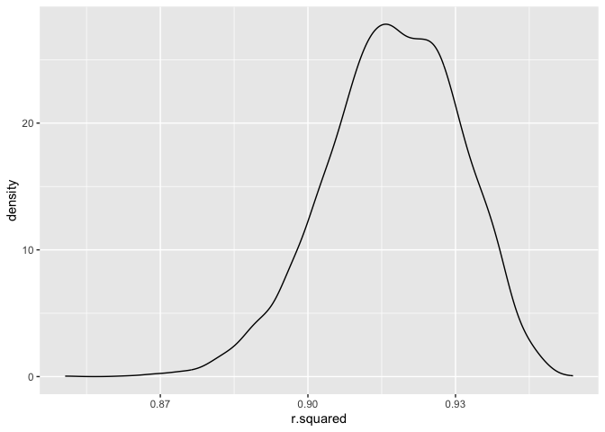
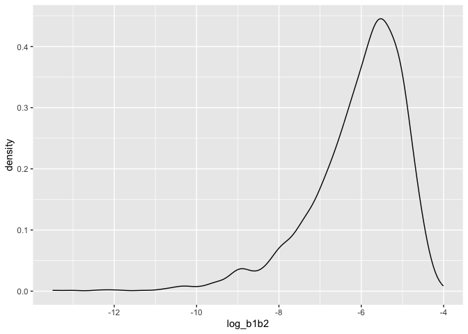
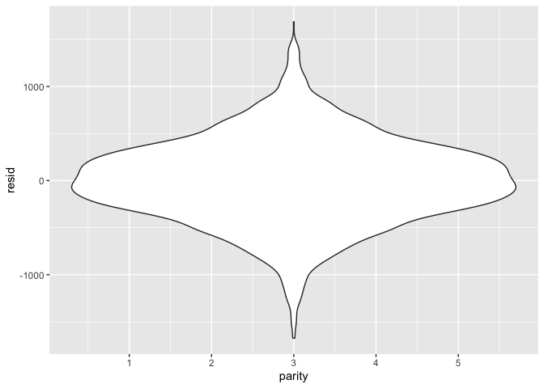
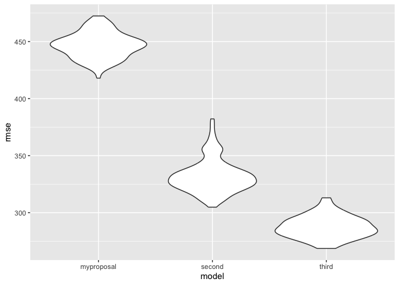

Homework Assignment 6 <br> (P8105_HW6_jao2195)
================
Jennifer Osei <br>
Saturday December 02, 2023

################################################################################ 

### Problem 0

################################################################################ 

Problem 0 This “problem” focuses on structure of your submission,
especially the use git and GitHub for reproducibility, R Projects to
organize your work, R Markdown to write reproducible reports, relative
paths to load data from local files, and reasonable naming structures
for your files.

To that end: <br> -Create a public GitHub repo + local R Project; we
suggest naming this repo / directory p8105_hw6_YOURUNI
(e.g. p8105_hw6_ajg2202 for Jeff), but that’s not required <br>

-Create a single .Rmd file named p8105_hw6_YOURUNI.Rmd that renders to
github_document create a subdirectory to store the local data files used
in the assignment, and use relative paths to access these data files
submit a link to your repo via Courseworks <br>

Your solutions to Problems 1 and 2 should be implemented in your .Rmd
file, and your git commit history should reflect the process you used to
solve these Problems. <br>

For this Problem, we will assess adherence to the instructions above
regarding repo structure, git commit history, and whether we are able to
knit your .Rmd to ensure that your work is reproducible. Adherence to
appropriate styling and clarity of code will be assessed in Problems 1+
using the style rubric. <br>

This homework includes figures; the readability of your embedded plots
(e.g. font sizes, axis labels, titles) will be assessed in Problems 1+.

``` r
#Needed libaries

# install.packages("tidyverse")
# install.packages("modelr")
# install.packages("boot")

library(tidyverse)
library(modelr)
library(boot)
library(dplyr)
```

################################################################################ 

### Problem 1

################################################################################ 

Background: The Washington Post has gathered data on homicides in 50
large U.S. cities and made the data available through a GitHub
repository here. You can read their accompanying article here.

**Problem 1A** <br> **Problem 1aQ** Create a city_state variable
(e.g. “Baltimore, MD”), and a binary variable indicating whether the
homicide is solved. Omit cities Dallas, TX; Phoenix, AZ; and Kansas
City, MO – these don’t report victim race. Also omit Tulsa, AL – this is
a data entry mistake. For this problem, limit your analysis those for
whom victim_race is white or black. Be sure that victim_age is numeric.

**Problem 1aC**

``` r
homicide_df =
  read_csv("data/homicide-data.csv", na = c("", "NA", "Unknown")) |>
    dplyr::mutate(
    city_state = str_c(city, state, sep = ", "),
    victim_age = as.numeric(victim_age),
    resolution = case_when(
      disposition == "Closed without arrest" ~ 0,
      disposition == "Open/No arrest"        ~ 0,
      disposition == "Closed by arrest"      ~ 1)
  ) |>
  dplyr::filter(victim_race %in% c("White", "Black")) |>
  dplyr::filter(!(city_state %in% c("Tulsa, AL", "Dallas, TX", "Phoenix, AZ", "Kansas City, MO"))) |>
  dplyr::select(city_state, resolution, victim_age, victim_sex, victim_race)
```

**Problem 1aA** In the data cleaning code below we create a `city_state`
variable, change `victim_age` to numeric, modifiy victim_race to have
categories white and non-white, with white as the reference category,
and create a `resolution` variable indicating whether the homicide is
solved. Lastly, we filtered out the following cities: Tulsa, AL; Dallas,
TX; Phoenix, AZ; and Kansas City, MO; and we retained only the variables
`city_state`, `resolution`, `victim_age`, `victim_sex`, and
`victim_race`.

**Problem 1B** <br> **Problem 1bQ** For the city of Baltimore, MD, use
the glm function to fit a logistic regression with resolved vs
unresolved as the outcome and victim age, sex and race as predictors.
Save the output of glm as an R object; apply the broom::tidy to this
object; and obtain the estimate and confidence interval of the adjusted
odds ratio for solving homicides comparing male victims to female
victims keeping all other variables fixed.

**Problem 1bA.** Next we fit a logistic regression model using only data
from Baltimore, MD. We model `resolved` as the outcome and `victim_age`,
`victim_sex`, and `victim_race` as predictors. We save the output as
`baltimore_glm` so that we can apply `broom::tidy` to this object and
obtain the estimate and confidence interval of the adjusted odds ratio
for solving homicides comparing non-white victims to white victims.

**Problem 1bC**

``` r
baltimore_glm =
  dplyr::filter(homicide_df, city_state == "Baltimore, MD") |>
  glm(resolution ~ victim_age + victim_sex + victim_race, family = binomial(), data = _)

baltimore_glm |>
  broom::tidy() |>
  mutate(
    OR = exp(estimate),
    OR_CI_upper = exp(estimate + 1.96 * std.error),
    OR_CI_lower = exp(estimate - 1.96 * std.error)) |>
  filter(term == "victim_sexMale") |>
  dplyr::select(OR, OR_CI_lower, OR_CI_upper) |>
  knitr::kable(digits = 3)
```

|    OR | OR_CI_lower | OR_CI_upper |
|------:|------------:|------------:|
| 0.426 |       0.325 |       0.558 |

**Problem 1C** <br> **Problem 1cQ** Now run glm for each of the cities
in your dataset, and extract the adjusted odds ratio (and CI) for
solving homicides comparing male victims to female victims. Do this
within a “tidy” pipeline, making use of purrr::map, list columns, and
unnest as necessary to create a dataframe with estimated ORs and CIs for
each city.

**Problem 1cA** Below, by incorporating `nest()`, `map()`, and
`unnest()` into the preceding Baltimore-specific code, we fit a model
for each of the cities, and extract the adjusted odds ratio (and CI) for
solving homicides comparing non-white victims to white victims. We show
the first 5 rows of the resulting dataframe of model results.

**Problem 1cC**

``` r
model_results =
  homicide_df %>%
  nest(data = -city_state) %>%
  dplyr::mutate(
    models = map(data, \(df) glm(resolution ~ victim_age + victim_sex + victim_race,
                             family = binomial(), data = df)),
    tidy_models = map(models, broom::tidy)) %>%
  dplyr::select(-models, -data) %>%
  unnest(cols = tidy_models) %>%
  dplyr::mutate(
    OR = exp(estimate),
    OR_CI_upper = exp(estimate + 1.96 * std.error),
    OR_CI_lower = exp(estimate - 1.96 * std.error)) %>%
  filter(term == "victim_sexMale") |>
  dplyr::select(city_state, OR, OR_CI_lower, OR_CI_upper)

model_results |>
  slice(1:5) |>
  knitr::kable(digits = 3)
```

| city_state      |    OR | OR_CI_lower | OR_CI_upper |
|:----------------|------:|------------:|------------:|
| Albuquerque, NM | 1.767 |       0.831 |       3.761 |
| Atlanta, GA     | 1.000 |       0.684 |       1.463 |
| Baltimore, MD   | 0.426 |       0.325 |       0.558 |
| Baton Rouge, LA | 0.381 |       0.209 |       0.695 |
| Birmingham, AL  | 0.870 |       0.574 |       1.318 |

**Problem 1D** <br> **Problem 1dQ** <br> Create a plot that shows the
estimated ORs and CIs for each city. Organize cities according to
estimated OR, and comment on the plot.

**Problem 1dA** Below we generate a plot of the estimated ORs and CIs
for each city, ordered by magnitude of the OR from smallest to largest.
From this plot we see that most cities have odds ratios that are smaller
than 1, suggesting that crimes with male victims have smaller odds of
resolution compared to crimes with female victims after adjusting for
victim age and race. This disparity is strongest in New yrok. In roughly
half of these cities, confidence intervals are narrow and do not contain
1, suggesting a significant difference in resolution rates by sex after
adjustment for victim age and race.

**Problem 1dC**

``` r
Model_Results = model_results |>
  mutate(city_state = fct_reorder(city_state, OR)) |>
  ggplot(aes(x = city_state, y = OR)) +
  geom_point() +
  geom_errorbar(aes(ymin = OR_CI_lower, ymax = OR_CI_upper)) +
  theme(axis.text.x = element_text(angle = 90, hjust = 1))

#Added ggsave to organize files and store problem output plots in a folder.
ggsave("plots/Problem_1_Model_Results.png",
        plot = Model_Results, device = "png", width = 10, height = 6, dpi = 300)

Model_Results
```

<!-- -->

################################################################################ 

### Problem 2

################################################################################ 

**Problem 2** <br>

**Problem 2a** <br> For this problem, we’ll use the Central Park weather
data similar to data we’ve seen elsewhere. The code chunk below (adapted
from the course website) will download these data.

``` r
#2a.Downloading data needed for Problem 2: Central Park Weather Data.
weather_df = 
  rnoaa::meteo_pull_monitors(
    c("USW00094728"),
    var = c("PRCP", "TMIN", "TMAX"), 
    date_min = "2022-01-01",
    date_max = "2022-12-31") |>
  mutate(
    name = recode(id, USW00094728 = "CentralPark_NY"),
    tmin = tmin / 10,
    tmax = tmax / 10) |>
  dplyr::select(name, id, everything())
```

**Problem 2b** <br> The bootstrap is helpful when you’d like to perform
inference for a parameter / value / summary that doesn’t have an
easy-to-write-down distribution in the usual repeated sampling
framework. We’ll focus on a simple linear regression with tmax as the
response with tmin and prcp as the predictors, and are interested in the
distribution of two quantities estimated from these data:

**Quantity 1: r^2** \<- Interested in producing r^2 distribution. <br>
**Quantity 2: log(β̂1xβ̂2)** \<- Interested in producing log(β̂1xβ̂2)
distribution as well.

1)  Use 5000 bootstrap samples and for each bootstrap sample. <br>
2)  Produce estimates of these two quantities (R-Squared and Log(B1B2).
    <br>
3)  Plot the distribution of your estimates, and describe these in
    words. <br>
4)  Using the 5000 bootstrap estimates, identify the 2.5% and 97.5%
    quantiles to provide a 95% confidence interval for r̂^2 and
    log(β̂1xβ̂2). <br>

**Note:** broom::glance() is helpful for extracting r̂^2 from a fitted
regression, and broom::tidy() (with some additional wrangling) should
help in computing log(β̂ 1xβ̂ 2)

``` r
## Problem 2b: Bootstrapping

# NOTES: TA in Discussion Board Stated that there was a TYPO in Problem 2. Should be b1b2 NOT b0b1. ~ Canvas 11/21/2023 ###

# weather_df (Dataset)
# tmax (Outcome/Response (Y)) 
# tmin & prcp (Predictor/Explanatory (X))

### Bootstrap Method ######
################################################################################
### Part 1 - R Squared #########################################################
################################################################################
# Creating Boostrapped R Squared
r_squared = weather_df %>%                                                        # Piping Weather Dataset.
                 modelr::bootstrap(n = 5000) %>%                                  # Bootstrapping 5000 iterations for R Squared Sample (#1 Complete)
                 mutate(models = map(strap, ~lm(tmax ~ tmin + prcp, data = .x) ), # linear model with tmax regressed with tmin + prcp.
                        results = map(models, broom::glance)) %>%                 # Using broom::glance for R^2.
                 dplyr::select(-models,-strap) %>%                                # Dropping columns.
                 unnest(results)                                                  # Unnesting Results/Estimates; Final Bootstrapped R-Squared Data.
                                                                                  # (#2 Complete)
# Creating R-Squared Plot
r_squared_plot =  r_squared %>%                                                   # Taking Final Bootstrapped R-Squared Data; Creating Density Plot.
                  ggplot(aes(x = r.squared)) + geom_density()                     # Final Bootstrapped R-Squared Density Plot. 
                     

# Displaying Bootstrapped R-Squared Plot in Knitted Document. (#3 Complete)
r_squared_plot
```

<!-- -->
<br> \#### Desciption of R-Squared in Words (#3 Complete)

The distribution of the R-Squared Bootstrapped Plot above looks
generally mildly left skewed <br> in its distribution with a mean
(average) value of R-squared of approximately 0.92.

``` r
# Calculating 95% Confidence Interval (CI) (2.5% and 97.5% quantiles) for Bootstrapped R^2.
ci_r_squared <- r_squared %>%
                summarize (
                ci_lower = quantile(r.squared, 0.025),
                ci_upper = quantile(r.squared, 0.975))

# Print the confidence interval (CI) for r_squared in neat, organized kable table (#4 Complete)
knitr::kable(ci_r_squared, digits=3)
```

| ci_lower | ci_upper |
|---------:|---------:|
|    0.889 |    0.941 |

``` r
################################################################################
### Part 2 - Log(b1b2) #########################################################
################################################################################

# Creating Boostrapped Log(b1b2) 
log_b1b2 = weather_df %>%                                                         # Piping Weather Dataset.
                modelr::bootstrap(n = 5000) %>%                                   # Bootstrapping 5000 iterations for Log(b1b2) Sample (#1 Complete)
                mutate(models = map(strap, ~lm(tmax ~ tmin + prcp, data = .x)),   # linear model with tmax regressed with tmin + prcp.
                results = map(models, broom::tidy)) %>%                           # Using broom::tidy for Log(b1b2).
                dplyr::select(-strap, -models) %>%                                # Dropping columns.
                unnest(results) %>%                                               # Unnesting Results/Estimates; Final Bootstrapped Log(b1b2) Data.
                                                                                  # (#2 Complete)     
  
                dplyr::select(id = `.id`, term, estimate) %>%                     # Selecting desired columns from the Bootstrapped Log(b1b2) Data.
                pivot_wider(names_from = term, values_from = estimate) %>%        # Pivot wides to change data form/structure.
                rename(beta1 = tmin, beta2 = prcp) %>%                            # Rename for ease of understanding. 
                mutate(log_b1b2 = log(beta1 * beta2))                             # Adding additional column with desired Log(Beta1 * Beta2).
                                                                                                                                                  
                                
# Creating Log(b1b2) Plot.
log_b1b2_plot = log_b1b2%>% 
                ggplot(aes(x = log_b1b2)) + geom_density()

# Displaying Bootstrapped Log(b1b2) Plot in Knitted Document. (#3 Complete)
log_b1b2_plot
```

<!-- -->

#### Desciption of Log(b1b2) in Words (#3 Complete)

The distribution of the Log(b1b2) Bootstrapped Plot above looks
generally very left skewed <br> in its distribution. This plot looks
even more left skewed than the previous R-Squared plot above. The
Log(b1b2) has a with a mean (average) value of Log(b1b2) of
approximately -5.25.

``` r
# Calculating 95% Confidence Interval (CI) (2.5% and 97.5% quantiles)for Bootstrapped log(b1b2) 
ci_log_b1b2 <- log_b1b2 %>% 
                dplyr::filter(!is.na(log_b1b2)) %>% 
                summarize(
                ci_lower = quantile(log_b1b2, 0.025),
                ci_upper = quantile(log_b1b2, 0.975))

# Print the confidence interval (CI) for log(b1*b2) in neat, organized kable table. (#4 Complete)
knitr::kable(ci_log_b1b2, digits=3)
```

| ci_lower | ci_upper |
|---------:|---------:|
|   -9.019 |   -4.571 |

``` r
########################
### END OF PROBLEM 2####
########################
```

################################################################################ 

### Problem 3

################################################################################ 

In this problem, you will analyze data gathered to understand the
effects of several variables on a child’s birthweight. <br> This
dataset, available here, consists of roughly 4000 children and includes
the following variables:

`babysex`: baby’s sex (male = 1, female = 2) <br> `bhead`: baby’s head
circumference at birth (centimeters) <br> `blength`: baby’s length at
birth (centimeteres) <br> `bwt`: baby’s birth weight (grams) <br>
`delwt`: mother’s weight at delivery (pounds) <br> `fincome`: family
monthly income (in hundreds, rounded) <br> `frace`: father’s race (1 =
White, 2 = Black, 3 = Asian, 4 = Puerto Rican, 8 = Other, 9 = Unknown)
<br> `gaweeks`: gestational age in weeks <br> `malform`: presence of
malformations that could affect weight (0 = absent, 1 = present) <br>
`menarche`: mother’s age at menarche (years) <br> `mheigth`: mother’s
height (inches) <br> `momage`: mother’s age at delivery (years) <br>
`mrace`: mother’s race (1 = White, 2 = Black, 3 = Asian, 4 = Puerto
Rican, 8 = Other) <br> `parity`: number of live births prior to this
pregnancy <br> `pnumlbw`: previous number of low birth weight babies
<br> `pnumgsa`: number of prior small for gestational age babies <br>
`ppbmi`: mother’s pre-pregnancy BMI <br> `ppwt`: mother’s pre-pregnancy
weight (pounds) <br> `smoken`: average number of cigarettes smoked per
day during pregnancy <br> `wtgain`: mother’s weight gain during
pregnancy (pounds) <br>

**Problem 3**

**Problem 3A** Load and clean the data for regression analysis <br>
(i.e. convert numeric to factor where appropriate, check for missing
data, etc.).

``` r
#Loading in Dataset, Birthweight 
birthweight <-read_csv("data/birthweight.csv")

birthweight <- birthweight |> #Overwritting dataset
        janitor::clean_names()
      
change_to_factor <- c("babysex", "frace", "malform", "mrace")

#Change to Factor 
birthweight_cleaned <- birthweight |>
                      mutate(across(all_of(change_to_factor), as.factor))

class(birthweight_cleaned$babysex)
```

    ## [1] "factor"

``` r
# Checking the Factors Factored Appropriately 
# levels(birthweight_cleaned$babysex)
# levels(birthweight_cleaned$frace)
# levels(birthweight_cleaned$mrace)
# levels(birthweight_cleaned$malform)

#Checking Missing Data, No Missing Data

any_NA <- any(is.na(birthweight_cleaned))

if (any_NA) {print("There is missing data in the dataset.")
     } else {print("There is no missing data in the dataset.")
  }
```

    ## [1] "There is no missing data in the dataset."

``` r
# Now the birthweight_cleaned dataset, factors are updated, and there is no missing data. 
# Dataset is now ready for regression analysis. 
```

**Problem 3B** **Model 1:** Propose a regression model for birthweight.

This model may be based on a hypothesized structure for the factors that
underly birthweight, on a data-driven model-building process, or a
combination of the two. (**I chose to build model based on a
hypothesized structure for the factors that underly birthweight in Model
1, below.**)

**\### Description of Modeling Process** For my modeling process, I
considered potential covariates that may most likely play a significant
role in the birthweight of the child. From my own understanding of
biology and some previous research, the covariates that I selected for
my proposed model to most likely effect a child’s birthweight was the
following: `mrace` , `parity`, `gaweeks`, `smoken`, `momage`. The other
covariates may play a role, but these were selected as highly likely to
impact birthweight, our outcome of interest in this linear regression
model proposal.

Describe your modeling process (**Description is above**) and show a
plot of model residuals against fitted values – use add_predictions and
add_residuals in making this plot (**Plot os generated below**):

``` r
#My Proposed Birthweight Model: 
my_proposed_bw_model1 = lm(bwt ~ mrace + parity + gaweeks + smoken + momage, data = birthweight_cleaned)

#Old school way of looking at model
summary(my_proposed_bw_model1)
```

    ## 
    ## Call:
    ## lm(formula = bwt ~ mrace + parity + gaweeks + smoken + momage, 
    ##     data = birthweight_cleaned)
    ## 
    ## Residuals:
    ##      Min       1Q   Median       3Q      Max 
    ## -1674.83  -273.36    -1.43   281.50  1687.09 
    ## 
    ## Coefficients:
    ##              Estimate Std. Error t value Pr(>|t|)    
    ## (Intercept)  896.0388    95.1859   9.414  < 2e-16 ***
    ## mrace2      -280.8960    15.5501 -18.064  < 2e-16 ***
    ## mrace3      -184.9792    69.1358  -2.676  0.00749 ** 
    ## mrace4      -188.7929    30.5225  -6.185 6.77e-10 ***
    ## parity       109.5653    66.0221   1.660  0.09708 .  
    ## gaweeks       59.8602     2.1915  27.315  < 2e-16 ***
    ## smoken       -10.8786     0.9441 -11.523  < 2e-16 ***
    ## momage         1.9233     1.8803   1.023  0.30643    
    ## ---
    ## Signif. codes:  0 '***' 0.001 '**' 0.01 '*' 0.05 '.' 0.1 ' ' 1
    ## 
    ## Residual standard error: 445.3 on 4334 degrees of freedom
    ## Multiple R-squared:  0.2452, Adjusted R-squared:  0.244 
    ## F-statistic: 201.2 on 7 and 4334 DF,  p-value: < 2.2e-16

``` r
summary(my_proposed_bw_model1)$coef
```

    ##                Estimate Std. Error    t value      Pr(>|t|)
    ## (Intercept)  896.038772 95.1858555   9.413571  7.573534e-21
    ## mrace2      -280.896049 15.5500776 -18.063964  2.205787e-70
    ## mrace3      -184.979200 69.1358296  -2.675591  7.487810e-03
    ## mrace4      -188.792943 30.5225381  -6.185362  6.767914e-10
    ## parity       109.565346 66.0221149   1.659525  9.708241e-02
    ## gaweeks       59.860151  2.1914995  27.314699 1.032371e-151
    ## smoken       -10.878569  0.9440956 -11.522741  2.786772e-30
    ## momage         1.923286  1.8803062   1.022858  3.064322e-01

``` r
coef(my_proposed_bw_model1)
```

    ## (Intercept)      mrace2      mrace3      mrace4      parity     gaweeks 
    ##  896.038772 -280.896049 -184.979200 -188.792943  109.565346   59.860151 
    ##      smoken      momage 
    ##  -10.878569    1.923286

``` r
#fitted.values(my_proposed_bw_model1) # Commented out; long output

#New School way of looking at model
my_proposed_bw_model1 |> 
  broom::glance() 
```

    ## # A tibble: 1 × 12
    ##   r.squared adj.r.squared sigma statistic   p.value    df  logLik    AIC    BIC
    ##       <dbl>         <dbl> <dbl>     <dbl>     <dbl> <dbl>   <dbl>  <dbl>  <dbl>
    ## 1     0.245         0.244  445.      201. 3.21e-259     7 -32638. 65294. 65351.
    ## # ℹ 3 more variables: deviance <dbl>, df.residual <int>, nobs <int>

``` r
my_proposed_bw_model1 |> 
  broom::tidy() 
```

    ## # A tibble: 8 × 5
    ##   term        estimate std.error statistic   p.value
    ##   <chr>          <dbl>     <dbl>     <dbl>     <dbl>
    ## 1 (Intercept)   896.      95.2        9.41 7.57e- 21
    ## 2 mrace2       -281.      15.6      -18.1  2.21e- 70
    ## 3 mrace3       -185.      69.1       -2.68 7.49e-  3
    ## 4 mrace4       -189.      30.5       -6.19 6.77e- 10
    ## 5 parity        110.      66.0        1.66 9.71e-  2
    ## 6 gaweeks        59.9      2.19      27.3  1.03e-151
    ## 7 smoken        -10.9      0.944    -11.5  2.79e- 30
    ## 8 momage          1.92     1.88       1.02 3.06e-  1

``` r
#Making simplified table of estimates and coefficients. 
my_proposed_bw_model1 |> 
  broom::tidy() |> 
  dplyr::select(term, estimate, p.value) |> 
  knitr::kable(digits = 3)
```

| term        | estimate | p.value |
|:------------|---------:|--------:|
| (Intercept) |  896.039 |   0.000 |
| mrace2      | -280.896 |   0.000 |
| mrace3      | -184.979 |   0.007 |
| mrace4      | -188.793 |   0.000 |
| parity      |  109.565 |   0.097 |
| gaweeks     |   59.860 |   0.000 |
| smoken      |  -10.879 |   0.000 |
| momage      |    1.923 |   0.306 |

``` r
#Plot of Fitted regressed on Residuals – use add_predictions and add_residuals 
birthweight_cleaned|>
  modelr::add_residuals(my_proposed_bw_model1) |> 
  modelr::add_predictions(my_proposed_bw_model1) |> 
  ggplot(aes(x = pred, y = resid)) + 
  geom_point() + 
  labs(title = "Residuals vs Fitted values",
       x = "Fitted values",
       y = "Residuals")
```

<!-- -->

**Problem 3C**

Compare your model (Model 1- Proposed Hypothesized Model) to two others
(Model 2 and Model 3 below):

**Model 2:** One using length at birth and gestational age as predictors
(main effects only).

``` r
comparision_model_2= lm( bwt ~ blength + gaweeks, data = birthweight_cleaned)
```

**Model 3:** One using head circumference, length, sex, and all
interactions (including the three-way interaction) between these.

``` r
comparision_model_3= lm(bwt ~ bhead + blength + babysex + bhead*blength + bhead*babysex +blength*babysex + bhead*blength*babysex, data =  birthweight_cleaned)
```

**Cross Validation (Needed for Comparision of Models 1, Model 2, Model
3) ** Make this comparison in terms of the cross-validated prediction
error; <br> use `crossv_mc` and functions in purrr as appropriate. Note
that although we expect your model to be reasonable, <br> model building
itself is not a main idea of the course and <br> we don’t necessarily
expect your model to be “optimal”.

``` r
#Creating Cross Validation for Models Above
cv_df = 
  crossv_mc(birthweight_cleaned, 100) 

cv_df =
  cv_df |> 
  mutate(
    train = map(train, as_tibble),
    test = map(test, as_tibble))


cv_df <- 
  cv_df |> 
  dplyr::mutate(
    myproposal_model  = map(train, \(df) lm(bwt ~ mrace + momage + parity + gaweeks + smoken, data = df)),
    second_model      = map(train, \(df) lm(bwt ~ blength + gaweeks, data = df)),
    third_model       = map(train, \(df) lm(bwt ~ bhead + blength + babysex + bhead*blength + bhead*babysex + blength*babysex + bhead*blength*babysex, data = df))
  ) |> 
  dplyr::mutate(
    rmse_myproposal = map2_dbl(myproposal_model, test, \(mod, df) rmse(model = mod, data = df)),
    rmse_second      = map2_dbl(second_model, test, \(mod, df) rmse(model = mod, data = df)),
    rmse_third       = map2_dbl(third_model, test, \(mod, df) rmse(model = mod, data = df))
  )


# Producing Final Cross-Validated Models 
# Displaying Plot of RMSE of 3 Cross-Validated Models 
cv_df |> 
   dplyr::select(starts_with("rmse")) |> 
   pivot_longer(
              everything(),
              names_to = "model", 
              values_to = "rmse",
              names_prefix = "rmse_") |> 
    dplyr::mutate(model = fct_inorder(model)) |> 
    ggplot(aes(x = model, y = rmse)) + geom_violin()
```

<!-- -->
\### **Comments on Model Comparisons** **Model 3** (The Three-Way
Interaction) has the lowest RMSE (Root Mean Squares Error) of roughly
300, <br> whereas **Model 2** (The Main Effects Model) , has a RMSE of
roughly 325 & **Model 1** (The Hypothesized Proposed Model by myself)
<br> has a RMSE of roughly 450. We know that generally, a model that has
a overall lower RMSE in comparison with other models, is usually the
better model. In this case, the third model **Model 3** (The Three-Way
Interaction) model seems to take into account additional factors in
regards to the interactions <br> between the covariates that
significantly brings down the RMSE, relative to **Model 1** (The
Hypothesized Proposed Model by myself) & **Model 2** (The Main Effects
Model), as they do not take these interactions into consideration.

**Model 3** seems to be the better model of the 3 models created above.
I would select and proceed with **Model 3** (The Three-Way Interaction)
based on these data.

######################## 

### END OF PROBLEM 3

######################## 

################################################################################ 

############# END OF HOMEWORK 6

################################################################################ 
